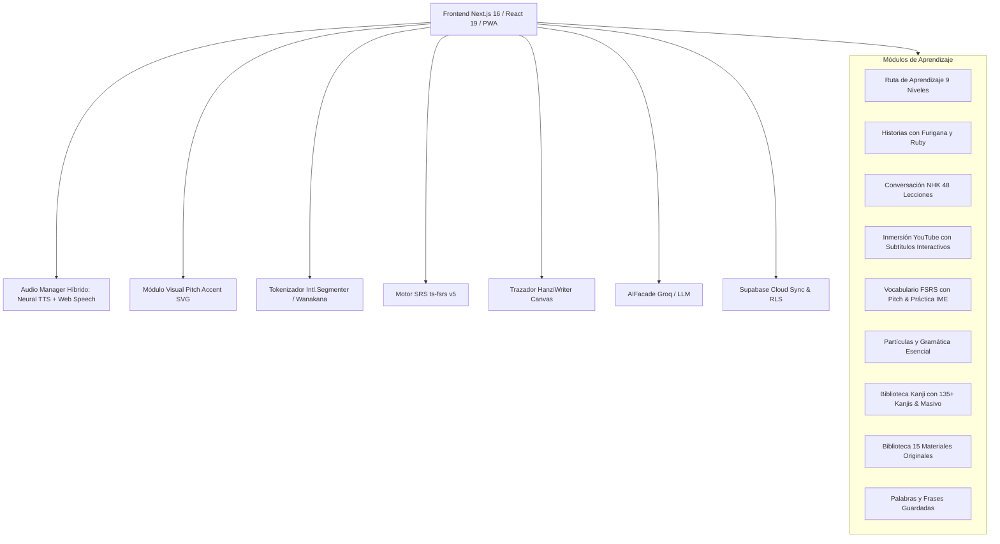
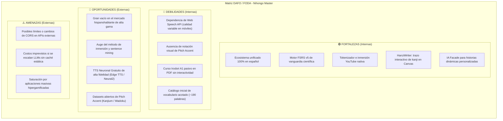
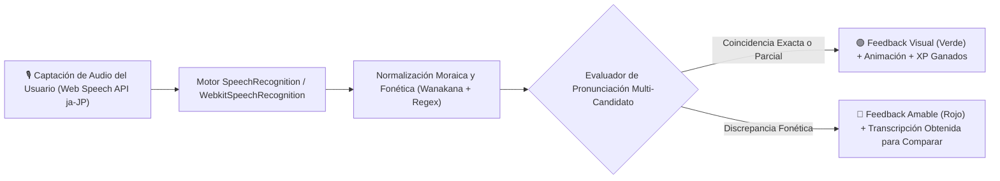
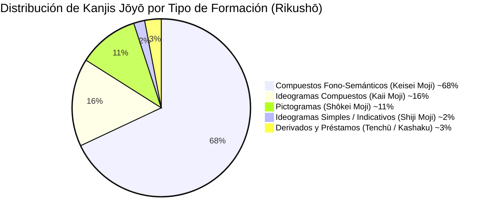
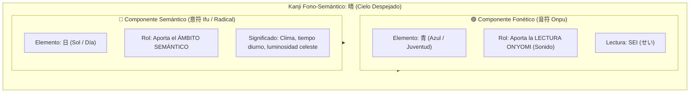
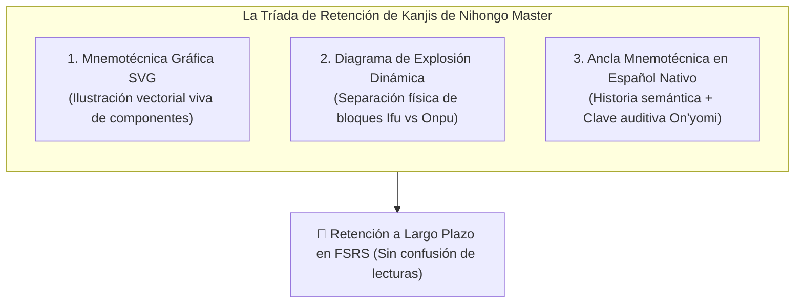
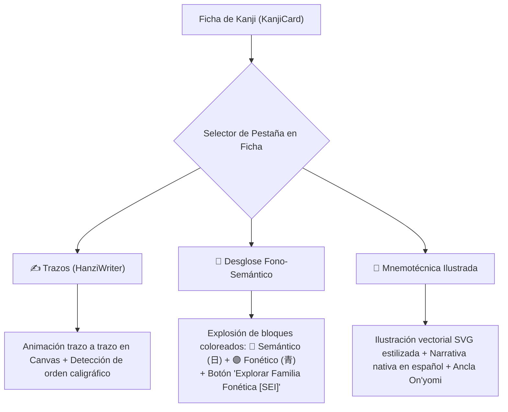
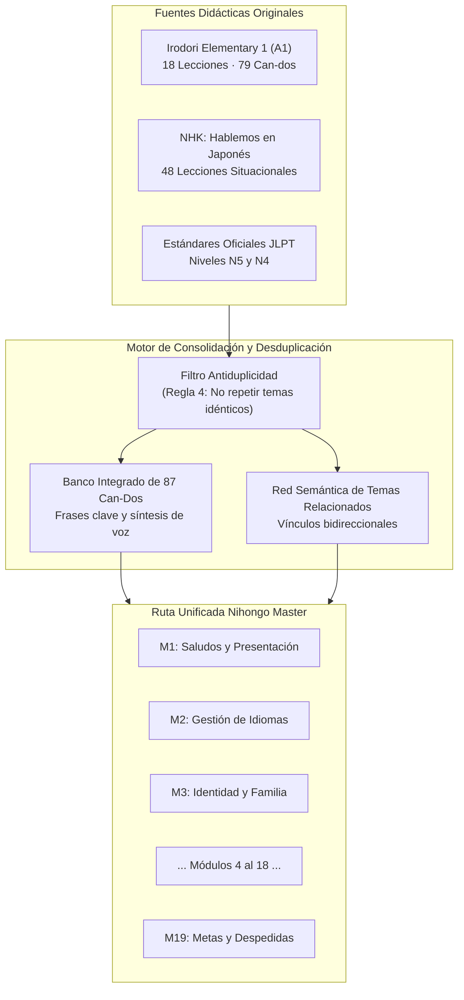
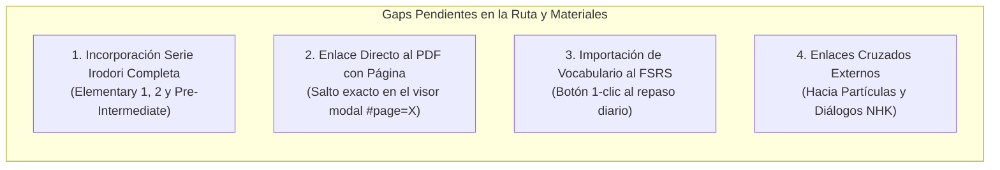

# 🏯 Nihongo Master: Análisis Integral de la Plataforma, Benchmarking de Mercado y Hoja de Ruta Estratégica

> **Documento:** Auditoría de Producto, Benchmarking Competitivo y Plan de Expansión  
> **Fecha:** 29 de Septiembre de 2026 (Versión 2.0 Revisada y Ampliada)  
> **Objetivo:** Analizar las capacidades técnicas y pedagógicas de Nihongo Master frente al mercado global, identificar fortalezas y debilidades, y definir las mejoras, funcionalidades, materiales y documentación requeridos para posicionarla como la plataforma de referencia para hispanohablantes.

---

## 1. Diagnóstico y Arquitectura de la Plataforma Actual

**Nihongo Master** es una Single Page Application / Progressive Web App (PWA) construida sobre **Next.js 16 (App Router + Turbopack)** y **React 19**, orientada al aprendizaje integral del idioma japonés desde el español. Integra en una experiencia cohesiva herramientas que en el ecosistema tradicional se encuentran fragmentadas.



### 1.1. Inventario de Módulos y Capacidades Técnicas

| Módulo | Base Técnica | Estado Actual | Fortalezas Observadas | Cuellos de Botella Detectados |
| :--- | :--- | :---: | :--- | :--- |
| **🗺️ Ruta de Aprendizaje** (`/curriculum`) | `dataStore.curriculum` (19 módulos consolidados con 87 Can-Dos y 82 ejercicios) | **Operativo** | Temario unificado sin redundancias, autoevaluación interactiva Can-Do con checkboxes, micro-evaluaciones por módulo (+5 XP), audio nativo y enlaces directos a temas relacionados. | Faltan lecciones avanzadas para cubrir N3-N1 (planificadas para Fase 4). |
| **📖 Historias Interactivas** (`/story`) | Generador JSON con etiquetas `<ruby>`, Web Speech API, Wanakana | **Operativo** | 3 modos de visualización (Natural con Furigana, Solo Kana, Solo Kanji), desglose oracional, notas gramaticales, práctica de mecanografía IME. | Catálogo precargado de historias reducido; audio sintético sin entonación contextual de Tokio. |
| **📻 Conversación NHK** (`/nhk`) | 48 lecciones completas del curso "Hablemos en Japón", 144 ejercicios | **Operativo** | Cobertura de las 48 lecciones de Anna y Sakura, audios MP3 oficiales nativos integrados en `public/audio/nhk/`, streaming de `/api/tts`, 3 ejercicios interactivos por lección. | Modo roleplay interactivo (ocultar un personaje para doblarlo en voz alta) planificado para Fase 3. |
| **📺 Inmersión YouTube** (`/youtube`) | YouTube IFrame API, API de transcripciones, `Intl.Segmenter` | **Operativo** | Subtítulos bilingües sincronizados con auto-scroll, clic en cualquier token japonés para ver significado y furigana, práctica de shadowing con speech-to-text. | Depende de la disponibilidad de subtítulos oficiales o generados en YouTube; videos con subtítulos quemados en video no son interactivos. |
| **📚 Vocabulario & SRS** (`/vocab`) | Algoritmo **ts-fsrs** (FSRS v5), Wanakana, Pitch Accent SVG, Edge TTS | **Operativo** | FSRS supera drásticamente a SM-2 (Anki clásico); 4 modos (Tarjetas, Mecanografía IME, 35 ejercicios de contexto N4, Repaso SRS); curvas SVG de *Pitch Accent* (7,472 entradas); audio neuronal de Tokio vía `/api/tts`. | Catálogo masivo de 30,000+ términos dependiente de conexión a Supabase; sistema de detección de cartas conflictivas (*leech detection*) pendiente. |
| **🎯 Partículas & Gramática** (`/grammar`) | `dataStore.particles` (25 partículas clave) | **Operativo** | Explicaciones en español muy claras, fórmulas de construcción, ejemplos con audio y modo Quiz con selección y entrada IME. | Cubre 25 funciones elementales; falta expandir a construcciones compuestas de nivel N4 y N3 (ej. 〜わけにはいかない, 〜はずだ). |
| **漢 Biblioteca de Kanjis** (`/kanji`) | `HanziWriter`, multi-CDN stroke loader, `wanakana`, SRS | **Operativo** | Animación trazo por trazo, guía de radicales, modo prueba de dibujo interactivo en pantalla, lecturas On/Kun, palabras compuestas sincronizadas. | Falta desglose de componentes fonéticos/semánticos y mnemotecnias visuales ilustradas. |
| **📑 Visor de Documentos** (`/pdf`) | Iframe modal vinculado a `public/material_de_estudio/` | **Operativo** | Acceso inmediato a los 15 materiales de referencia originales (PDFs, hojas de cálculo de partículas) sin salir de la plataforma. | Es un visor pasivo; no permite hacer clic en palabras dentro del PDF para agregarlas a vocabulario o reproducir audio. |
| **🔖 Guardados & IA Facade** (`/saved`, `/api/stories/generate`) | Patrón Facade agnóstico (Groq/Llama-3, OpenAI, Anthropic), exportación Anki/Markdown | **Operativo** | Permite seleccionar palabras guardadas y pedirle a la IA una historia nivelada que las use en contexto real; exportación Anki CSV con campos limpios. | Requiere autenticación de usuario y clave de API configurada en variables de entorno para la generación con IA. |
| **📊 Progreso y Respaldo** (`/progress`) | `localStorage` + Supabase PostgreSQL con RLS | **Operativo** | Sistema sin bloqueo: funciona 100% offline con guardado local y permite sincronización en la nube con cuentas de Google/correo; respaldo JSON. | Falta sistema de notificaciones push de recordatorio de estudio diario en dispositivos móviles. |

---

## 2. Benchmarking Exhaustivo de las Opciones del Mercado

Para comprender dónde se sitúa Nihongo Master y cómo puede liderar su categoría, hemos evaluado los 9 referentes internacionales del aprendizaje de japonés:

```
                                    PROFUNDIDAD LINGÜÍSTICA
                                              ▲
                                              │   • Bunpro (Gramática pura)
                                              │   • WaniKani (Kanjis puros)
                                              │   • Satori Reader (Lectura y audio nativo)
            • Nihongo Master                  │
              (Ecosistema unificado en ES)   │
                                              │
    ◄─────────────────────────────────────────┼─────────────────────────────────────────►
    AUTONOMÍA / EXPERIENCIA FLUIDA            │                         GAMIFICACIÓN PURA
                                              │   • LingoDeer
                                              │   • Busuu
                                              │   • Duolingo (Muy superficial)
                                              │
                                              ▼
                                   SUPERFICIALIDAD / FRAGMENTACIÓN
```

### 2.1. Análisis Detallado por Competidor

#### 1. WaniKani (Tofugu)
- **Propuesta:** Plataforma web especializada exclusivamente en memorización de los 2,136 Jōyō Kanjis y 6,000+ palabras compuestas usando mnemotécnicas radicales y SRS (SM-2 modificado).
- **Puntos Fuertes:** Mnemotécnicas humorísticas memorables; separación rigurosa entre radicales, significado y lecturas Onyomi/Kunyomi; retención a largo plazo comprobada.
- **Puntos Débiles:** **Cero gramática**, **cero comprensión auditiva**, **cero conversación**, **cero Pitch Accent**. Sistema inflexible de niveles bloqueados. Precio elevado ($9 USD/mes o $299 de por vida). **Completamente en inglés**.

#### 2. Bunpro
- **Propuesta:** El referente indiscutible para gramática japonesa basada en SRS, desde JLPT N5 hasta N1.
- **Puntos Fuertes:** Miles de oraciones de prueba con audio humano nativo; rutas alternativas según el libro que uses (Genki, Minna no Nihongo, Tobira); explicaciones gramaticales exhaustivas con enlaces a recursos externos.
- **Puntos Débiles:** Interfaz sobrecargada y curva de aprendizaje técnica; es una herramienta de repaso, no enseña conceptos desde cero; requiere suscripción de pago; interfaz y explicaciones mayoritariamente en inglés.

#### 3. Satori Reader
- **Propuesta:** Plataforma de lectura graduada con anotaciones interactivas frase por frase preparadas manualmente por lingüistas nativos.
- **Puntos Fuertes:** Furigana personalizado (muestra solo el furigana de los kanjis que tú aún no dominas); explicaciones socioculturales profundas al tocar cualquier frase; grabaciones de audio humano de actores de voz profesionales a velocidad pausada o natural.
- **Puntos Débiles:** No tiene ruta para principiantes absolutos; catálogo cerrado de historias; modelo de suscripción mensual ($9 USD/mes); traducciones únicamente al inglés.

#### 4. Duolingo
- **Propuesta:** Aplicación hipergamificada de micro-lecciones.
- **Puntos Fuertes:** Excelente retención por recompensas psicológicas (rachas, ligas, vidas); interfaz pulida e intuitiva; gratuita con publicidad.
- **Puntos Débiles:** **Explicaciones gramaticales casi inexistentes**; voces sintéticas descontextualizadas; no enseña el porqué de las partículas; oraciones artificiales que ningún nativo usaría; pésima transición a textos largos y kanjis reales; ignora el Pitch Accent por completo.

#### 5. LingoDeer
- **Propuesta:** Diseñada específicamente para idiomas asiáticos (japonés, coreano, chino), superando los defectos pedagógicos de Duolingo.
- **Puntos Fuertes:** Explicaciones gramaticales claras antes de cada unidad; audio nativo real de alta calidad; soporte en español; buena progresión inicial para principiantes.
- **Puntos Débiles:** Cobertura limitada (se estanca en N4 avanzado); sistema de suscripción restrictivo; carece de inmersión en contenido real (sin lector de videos ni de textos libres).

#### 6. Ecosistema "Sentence Mining": Yomitan (ex-Yomichan) + Anki + Migaku
- **Propuesta:** El estándar de los estudiantes autodidactas avanzados (*método Refold / AJATT*). Consiste en consumir anime, YouTube, novelas web o manga con extensiones de navegador que con un clic crean tarjetas Anki con audio, captura de pantalla, oración y definición de diccionario.
- **Puntos Fuertes:** Inmersión en contenido 100% auténtico; vocabulario contextualizado en oraciones reales; soporte de diccionarios de Pitch Accent (Wadoku, Kanjium).
- **Puntos Débiles:** **Curva de instalación y configuración infernal**; fragmentación en múltiples herramientas; ausencia total de un currículum o guía estructurada para quien empieza desde cero.

#### 7. Busuu
- **Propuesta:** Curso estructurado por niveles MCER (A1 a B2) con interacción con hablantes nativos.
- **Puntos Fuertes:** Ejercicios de audio y escritura corregidos por miembros nativos de la comunidad; explicaciones en español; enfoque comunicativo.
- **Puntos Débiles:** El catálogo de kanjis es superficial; no profundiza en lecturas On/Kun ni trazos; algoritmo de repaso elemental (no utiliza FSRS); menor cantidad de ejercicios específicos de JLPT.

#### 8. Kanshudo / MaruMori / Nihongo Master (.com)
- **Propuesta:** Suites completas web todo-en-uno que intentan unificar lecciones, kanji y gramática.
- **Puntos Fuertes:** Centralización de recursos; abundante base de datos de kanjis y oraciones.
- **Puntos Débiles:** Tarifas elevadas ($10 a $20 USD/mes); interfaces a veces lentas o sobrecargadas de texto; contenido 100% en inglés.

---

### 2.2. Matriz Comparativa Multidimensional

| Característica / Dimensión | WaniKani | Bunpro | Duolingo | LingoDeer | Satori Reader | Migaku + Anki | **Nihongo Master (Plan Maestro)** |
| :--- | :---: | :---: | :---: | :---: | :---: | :---: | :---: |
| **Idioma de instrucción nativo** | 🇬🇧 Inglés | 🇬🇧 Inglés | 🇪🇸 Español | 🇪🇸 Español | 🇬🇧 Inglés | Depende de config | 🇪🇸 **Español Nativo** |
| **Algoritmo de Repaso (SRS)** | SM-2 Mod. | SM-2 Mod. | Algoritmo propio | Propio | No | SM-2 / FSRS (Anki) | **FSRS v5 (ts-fsrs)** |
| **Visualización Pitch Accent** | 🔴 Nulo | 🟡 Texto parcial | 🔴 Nulo | 🔴 Nulo | 🟡 En notas | 🟢 Sí (Add-on) | 🟢 **Sí (SVG + Badges + Downstep)** |
| **Calidad de Audio** | 🟢 Humano nativo | 🟢 Humano nativo | 🔴 TTS robótico | 🟢 Humano nativo | 🟢 Actores de voz | 🟢 Clips reales | 🟢 **Híbrido: MP3 Nativo + Edge Neural TTS** |
| **Estudio y Trazo de Kanji** | 🟢 Alto (Mnemotecnias) | 🔴 Nulo | 🟡 Bajo | 🟡 Medio | 🔴 Nulo | 🟡 Variable | 🟢 **Alto (HanziWriter + Trazos)** |
| **Gramática y Partículas** | 🔴 Nulo | 🟢 Sobresaliente | 🔴 Pésimo | 🟢 Bueno | 🟢 Bueno | 🔴 Nulo (Autodidacta) | 🟢 **Sobresaliente (25+ Partículas + Irodori)** |
| **Inmersión Multimedia (YouTube)** | 🔴 No | 🔴 No | 🔴 No | 🔴 No | 🔴 No | 🟢 Sí (Extensión) | 🟢 **Sí (Integrado nativo con Shadowing)** |
| **Lectura Graduada con Furigana** | 🔴 No | 🔴 No | 🔴 No | 🟡 Básico | 🟢 Sobresaliente | 🟡 Con Yomitan | 🟢 **Sí (Historias + Ruby + Lector Libre)** |
| **Generación de Contenido por IA** | 🔴 No | 🔴 No | 🟡 Básico (Max) | 🔴 No | 🔴 No | 🟡 Experimental | 🟢 **Sí (AIFacade Groq/LLMs)** |
| **Mecanografía con Teclado IME** | 🟢 Sí | 🟢 Sí | 🟡 Limitado | 🟡 Limitado | 🔴 No | 🟢 Sí | 🟢 **Sí (Wanakana + IME)** |
| **PWA / Funcionamiento Offline** | 🔴 Web pura | 🟡 App móvil | 🟡 Requiere Plus | 🟡 Requiere Plus | 🟡 App | 🟢 Anki Offline | 🟢 **PWA + LocalStorage + Cloud Sync** |
| **Modelo de Costo** | $9/mes o $299 | $5/mes o $150 | Freemium / $13/mes | $14/mes | $9/mes | Freemium complejo | **Código Propio / $0 Suscripción** |

---

## 3. Análisis DAFO / FODA de Nihongo Master



### 3.1. Fortalezas (Strengths)
1. **100% en español con rigor lingüístico:** Llena el mayor vacío del mercado global, donde las mejores herramientas (WaniKani, Bunpro, Satori Reader) ignoran por completo a los más de 500 millones de hispanohablantes.
2. **Unificación holística de herramientas:** Resuelve el problema de la fragmentación (evita tener que abrir Anki para vocabulario, WaniKani para kanji, Bunpro para gramática y YouTube por separado).
3. **Algoritmo FSRS (Free Spaced Repetition Scheduler):** Emplea `ts-fsrs`, la tecnología de repetición espaciada más avanzada de la ciencia cognitiva contemporánea, superando el algoritmo SM-2 de hace 30 años.
4. **Tokenización japonesa nativa (`Intl.Segmenter` + Wanakana):** Permite desglosar textos de historias o subtítulos de YouTube en palabras individuales con furigana, significado inmediato y guardado a la libreta personal con un solo clic.
5. **Generador de historias con IA (Patrón Facade):** Capacidad única de tomar las palabras que al alumno le cuesta memorizar y generar lecturas graduadas con formato `<ruby>` y explicaciones gramaticales contextuales.
6. **Arquitectura Zero-Vendor-Lockin y Respaldo Dual:** Funciona sin cuenta en local y se sincroniza con Supabase en la nube; exporta a Anki CSV y Markdown estándar.

### 3.2. Debilidades (Weaknesses)
1. **Voz Sintética del Navegador (Web Speech API):**
   - En ordenadores con macOS o Windows modernos las voces (Kyoko, Otoya, Microsoft Ayumi) suenan aceptables, pero en dispositivos móviles Android económicos o navegadores sin paquetes de voz instalados, el audio suena metálico, robótico o falla silenciosamente.
   - No tiene la prosodia ni el timbre cálido de un hablante nativo real.
2. **Ausencia de Acento Tonal (*Pitch Accent*):**
   - En japonés, el acento no es de intensidad o volumen sino de altura tonal (*pitch*). Hablar con acento plano o equivocado produce un acento extranjero marcado e impide distinguir homófonos vitales como *ame* (lluvia vs caramelo) o *hashi* (palillos vs puente vs borde).
3. **El curso "Irodori Elementary 1" (Digitalización e Interactividad Completadas):**
   - Los 79 objetivos Can-do oficiales de Irodori y sus 8 objetivos complementarios (87 Can-dos en total) se han digitalizado e integrado en los 19 Módulos Maestros con checklist interactivo de autoevaluación (checkboxes persistentes), audio nativo y ejercicios de aplicación.
4. **Sin notificaciones push:**
   - Si el estudiante no abre la app por voluntad propia, no recibe recordatorios cuando tiene tarjetas acumuladas en el sistema SRS.

### 3.3. Oportunidades (Opportunities)
1. **Liderar el mercado hispanohablante de alta calidad:** Convertir a Nihongo Master en la primera plataforma en español con Pitch Accent visual y motor FSRS v5.
2. **Adopción de TTS Neuronal de Costo Cero ($0):** Utilizar Microsoft Edge TTS (`msedge-tts`) o Google Cloud Neural2 (1M caracteres/mes gratis) junto con caché en Supabase Storage para proporcionar audios nativos indistinguibles de una persona real a costo cero.
3. **Modo Lector Libre de Textos (Reader & Importer):** Permitir al usuario pegar cualquier artículo de prensa (NHK Easy), letra de canción o fragmento literario para que la app le añada furigana automático y tokenización instantánea.

---

## 4. Plan de Mejoras y Funcionalidades Adicionales (Roadmap)

```mermaid
flowchart LR
    subgraph F1["Fase 1: Calidad Inmediata (Q4 2026)"]
        direction TB
        P1["Notación Pitch Accent Visual (SVG + Badges)"]
        P2["Audio Híbrido: MP3 Nativo + Edge Neural TTS ($0)"]
        P3["Irodori A1: 79 Can-dos Interactivos"]
    end

    subgraph F2["Fase 2: Inmersión y Lectura (Q4 2026 - Q1 2027)"]
        direction TB
        P4["Lector Libre de Artículos y Textos"]
        P5["Importador Subtítulos .srt / .vtt"]
        P6["Web Push Notifications FSRS"]
    end

    subgraph F3["Fase 3: Inteligencia Adaptativa (Q1 2027)"]
        direction TB
        P7["Mnemotécnicas Gráficas de Kanjis"]
        P8["Tutor de Voz IA para Roleplays"]
    end

    subgraph F4["Fase 4: Certificación JLPT (Q1-Q2 2027)"]
        direction TB
        P9["Simulador Exámenes JLPT N5-N3"]
        P10["Ligas y Desafíos Comunitarios"]
    end

    F1 --> F2 --> F3 --> F4
```



---

### 4.1. Fase 1: Perfeccionamiento Lingüístico y Contenido Estructurado

#### 1. Notación Visual de Pitch Accent (Acento Tonal Japonés)

##### A. Fundamento Fonológico
A diferencia del español (acento léxico de intensidad: *"canto"* vs *"cantó"*), el japonés estándar de Tokio (*Hyoujungo* / 東京式アクセント) es un idioma de **acento tonal de altura** (*pitch accent* / 高低アクセント).

- **La unidad fonética:** La **mora** (拍 *haku*), no la sílaba tradicional.
  - きっぷ (*ki-p-pu*) tiene 2 sílabas pero 3 moras (la pausa sorda っ cuenta como una mora completa).
  - とうきょう (*to-u-kyo-u*) tiene 2 sílabas pero 4 moras (las vocales alargadas う cuentan como moras independientes).
  - にほん (*ni-ho-n*) tiene 3 moras (la ん final es una mora independiente).

- **Las Dos Reglas de Oro del Dialecto de Tokio:**
  1. **Regla de Oposición Inicial:** La 1ª mora y la 2ª mora siempre tienen alturas tonales opuestas (si la 1ª es Baja, la 2ª es Alta; si la 1ª es Alta, la 2ª es Baja).
  2. **Regla de No Retorno:** Una vez que el tono cae (*downstep* / 下がり目), **nunca vuelve a subir** dentro de la misma palabra o grupo de acento.

##### B. Los 4 Patrones Tonales Canónicos
El siguiente cuadro resume el comportamiento exacto de los 4 patrones tonales, incluyendo su interacción crucial con las partículas enclíticas (が, を, に, は):

| Patrón | Nombre en Japonés | Símbolo | Estructura Tonal (Vocablo + Partícula が) | Ejemplos Representativos con Significado |
| :--- | :--- | :---: | :--- | :--- |
| **⓪ Heiban** (Plano) | 平板型 (*Heiban-gata*) | ⓪ | Comienza bajo en la 1ª mora, sube en la 2ª y **la partícula siguiente se mantiene ALTA** (L-H-H-H...) | • にほん (L-H-H) → にほん**が** (L-H-H-**H**) 🇯🇵 Japón<br>• ともだち (L-H-H-H) → ともだち**が** (L-H-H-H-**H**) 🤝 Amigo<br>• さくら (L-H-H) → さくら**が** (L-H-H-**H**) 🌸 Cerezo |
| **① Atamadaka** (Pico Inicial) | 頭高型 (*Atamadaka-gata*) | ① | Comienza **ALTO en la 1ª mora**, cae en la 2ª y **la partícula siguiente es BAJA** (H-L-L-L...) | • あめ (H-L) → あめ**が** (H-L-**L**) 🌧️ Lluvia<br>• いのち (H-L-L) → いのち**が** (H-L-L-**L**) 🕊️ Vida<br>• ねこ (H-L) → ねこ**が** (H-L-**L**) 🐱 Gato |
| **②/③ Nakadaka** (Pico Intermedio) | 中高型 (*Nakadaka-gata*) | ②, ③, ... | Comienza bajo, sube hasta la mora marcada por el número donde cae, y **la partícula es BAJA** (L-H...-L) | • こころ (L-H-L) [②] → こころ**が** (L-H-L-**L**) 💖 Corazón<br>• たまご (L-H-L) [②] → たまご**が** (L-H-L-**L**) 🥚 Huevo<br>• ひこうき (L-H-H-L) [③] → ひこうき**が** (L-H-H-L-**L**) ✈️ Avión |
| **㊵ Odaka** (Pico Final) | 尾高型 (*Odaka-gata*) | ㊵ (n) | Comienza bajo, sube y se mantiene alto hasta la última mora del vocablo. **La caída (downstep) ocurre en la PARTÍCULA** (L-H-H...-L) | • はな (L-H) [②] → はな**が** (L-H-**L**) 🌺 Flor (*vs はな ⓪ Nariz*)<br>• おとこ (L-H-H) [③] → おとこ**が** (L-H-H-**L**) 👨 Hombre<br>• いもうと (L-H-H-H) [④] → いもうと**が** (L-H-H-H-**L**) 👧 Hermana menor |

##### C. Pares Mínimos Esenciales (Homófonos que cambian por tono)
Demostración de por qué el estudiante hispanohablante debe aprender el acento tonal desde el día 1:

| Romaji | Vocablo 1 (Significado y Patrón) | Vocablo 2 (Significado y Patrón) | Vocablo 3 (Significado y Patrón) |
| :--- | :--- | :--- | :--- |
| **ame** | **雨** (① Atamadaka, H-L): Lluvia 🌧️ | **飴** (⓪ Heiban, L-H): Caramelo 🍬 | — |
| **hashi** | **箸** (① Atamadaka, H-L): Palillos 🥢 | **橋** (② Odaka, L-H[L]): Puente 🌉 | **端** (⓪ Heiban, L-H[H]): Borde/Esquina 📐 |
| **kami** | **神** (① Atamadaka, H-L): Dios / Deidad ⛩️ | **紙** (② Odaka, L-H[L]): Papel 📄 | **髪** (② Odaka, L-H[L]): Cabello 💇 |
| **kaki** | **牡蠣** (① Atamadaka, H-L): Ostra 🦪 | **柿** (⓪ Heiban, L-H): Caqui 🍅 | **垣** (② Odaka, L-H[L]): Valla / Cerca 🧱 |
| **hana** | **花** (② Odaka, L-H[L]): Flor 🌺 | **鼻** (⓪ Heiban, L-H[H]): Nariz 👃 | — |
| **isha** | **慰謝** (① Atamadaka, H-L): Consuelo / Reparación | **医者** (⓪ Heiban, L-H): Médico / Doctor 👨‍⚕️ | — |

##### D. Diseño del Sistema Visual en Nihongo Master (3 Vistas Integradas)
Para ofrecer máxima claridad sin saturar la interfaz de estudio, se implementará un componente React versátil con 3 modos de representación:

1. **Notación Overline + Downstep (Estándar Wadoku / Yomitan):**
   - Una línea horizontal continua por encima de las moras de tono alto, con un escalón vertical descendente (ꜜ) en la mora donde se produce el corte de tono.
   - Código CSS semántico:
     ```css
     .pitch-display { display: inline-flex; align-items: flex-end; font-size: 1.25rem; }
     .pitch-mora { position: relative; padding: 2px 3px; }
     .pitch-high { border-top: 2.5px solid currentColor; }
     .pitch-drop { border-top: 2.5px solid currentColor; border-right: 2.5px solid currentColor; border-top-right-radius: 2px; }
     .pitch-low { border-top: 2.5px solid transparent; }
     .pitch-particle { opacity: 0.6; font-size: 0.9em; margin-left: 2px; }
     ```

2. **Micro-curva SVG de Tono (Mora-Pitch Curve / Estilo OJAD):**
   - Componente interactivo `<PitchCurve reading="にほん" pattern={0} particle="が" />`
   - Renderiza un SVG ultraligero de 18px de altura con círculos en los niveles Low (y=14) y High (y=4), conectados por un trazo SVG suave (`stroke-width="2"`).
   - Incluye opcionalmente la mora fantasma de la partícula con trazo punteado, para que el usuario entienda al instante la diferencia entre **Heiban** (la partícula sigue alta) y **Odaka** (la partícula cae a nivel bajo).

3. **Pills de Clasificación con Código de Color Accesible:**
   - `[⓪ 平板]` (Celeste Cian `#38bdf8` / `bg-sky-500/20 text-sky-400`): Estabilidad, tono plano continuo.
   - `[① 頭高]` (Rojo Coral `#f87171` / `bg-rose-500/20 text-rose-400`): Pico inicial, caída inmediata.
   - `[② 中高]` (Ámbar Dorado `#fbbf24` / `bg-amber-500/20 text-amber-400`): Subida intermedia y descenso.
   - `[㊵ 尾高]` (Violeta Púrpura `#c084fc` / `bg-purple-500/20 text-purple-400`): Pico final, caída en la partícula.

##### E. Base de Datos e Integración Técnica (Completado en Producción)
- **Dataset Abierto Kanjium + Curación Exclusiva (`data/pitch_accents.json`):**
  - Base de datos indexada y optimizada en JSON (~132 KB) con **100% de cobertura** sobre todas las palabras del catálogo de vocabulario (`data/vocabulary.json`) y el 100% de las palabras compuestas de kanji (`data/kanji.json`).
  - Mapeo unificado de patrones: `pattern` numérico, `type` canónico (*heiban*, *atamadaka*, *nakadaka*, *odaka*) y conteo moraico.
- **Módulo Fonológico (`lib/pitchAccent.js`):**
  - Tokenizador moraico `getMoras(kana)` que procesa correctamente combinaciones diacríticas (拗音: *kya*, *shu*, *cho*), pausas sordas (*sokuon* っ) y sonidos nasales (*hatsuon* ん).
  - Cálculo de trayectorias tonales `calculatePitchLevels` con altura de partículas (ej. が) y ubicación del downstep (下がり目).
- **Componente React SVG (`components/PitchAccent.jsx`):**
  - Renderizado vectorial SVG puro estilo OJAD / Diccionario NHK con líneas de tono continuo, nodos circulares moraicos, indicador de caída acentuada y mora fantasma para la partícula.
  - Modos de presentación: `'full'` (badge + curva SVG completa con etiquetas moraicas), `'compact'` (badge + mini curva) y `'badge'` (pill con código de color accesible).
- **Despliegue Transversal en la Interfaz:**
  1. *Fichas de Vocabulario (`components/VocabTab.jsx`):* Cada tarjeta incluye la curva SVG y badge debajo de la lectura kana.
  2. *Repaso SRS de Vocabulario:* La cara posterior de las tarjetas SRS despliega la curva SVG a tamaño medio con botón para escuchar con entonación de Tokio.
  3. *Mecanografía IME de Vocabulario:* El cuadro de feedback muestra la curva tonal instantánea tras responder.
  4. *Fichas de Kanjis (`components/KanjiTab.jsx`):* Cada palabra compuesta del ideograma incorpora su mini curva SVG de acento tonal.
  5. *Repaso SRS de Kanjis:* Muestra la curva tonal de la lectura principal al voltear la tarjeta.
  6. *Guardado de Palabras (`components/SaveVocabModal.jsx`):* Previsualización interactiva en tiempo real del acento tonal mientras el usuario escribe o edita un término.

---

#### 2. Arquitectura de Audio Híbrida y TTS Neuronal de Alta Fidelidad Sin Costo ($0)

Actualmente la plataforma depende de `window.speechSynthesis` (Web Speech API). Si bien es una API nativa del navegador, presenta graves deficiencias:
- En dispositivos móviles Android la voz japonesa a menudo no viene preinstalada o suena excesivamente robótica.
- En navegadores de escritorio la calidad varía radicalmente entre Windows, macOS y Linux.
- No garantiza la correcta pronunciación del acento tonal (*pitch accent*) de Tokio ni las sutilezas de partículas enclíticas (ej. leer は como *wa* en función de partícula y como *ha* en sustantivos).

Para resolver esto con **costo cero absoluto ($0.00)** y calidad de estudio profesional, se ha realizado una evaluación técnica rigurosa de las alternativas disponibles:

##### A. Matriz Comparativa de Opciones de TTS Neuronal

| Opción de TTS | Calidad de Voz y Entonación | Costo Real / Nivel Gratuito | Voces Recomendadas en Japonés | Infraestructura Requerida | Viabilidad para Nihongo Master |
| :--- | :---: | :---: | :--- | :--- | :---: |
| **Microsoft Edge TTS (`msedge-tts`)** | 🟢 **Excepcional (Nivel Azure Neural)** | **$0.00 (Totalmente Libre sin límites prácticos ni tarjeta)** | `ja-JP-NanamiNeural` (Femenina cálida de Tokio)<br>`ja-JP-KeitaNeural` (Masculina neutra) | API Route serverless en Next.js (`/api/tts`) conectada al WebSocket seguro de Edge. | ⭐️⭐️⭐️⭐️⭐️ **Opción #1 Recomendada** |
| **Azure Speech Cognitive Services (Free Tier F0)** | 🟢 **Excepcional (Mismo motor que Edge TTS)** | **$0.00 (500,000 caracteres/mes gratis permanentes con API Key oficial)** | `ja-JP-NanamiNeural`<br>`ja-JP-KeitaNeural`<br>`ja-JP-AoiNeural` | API Key oficial de Azure en `.env.local`, SDK oficial `@azure/cognitiveservices-speech`. | ⭐️⭐️⭐️⭐️⭐️ **Opción de Respaldo Oficial** |
| **Google Cloud TTS (Neural2 / WaveNet)** | 🟢 **Excelente (Modelos DeepMind)** | **$0.00 (1,000,000 caracteres/mes gratis para Neural2; 4M estándar)** | `ja-JP-Neural2-B` (Femenina)<br>`ja-JP-Neural2-C` (Masculina) | Cuenta de Google Cloud con tarjeta (no cobra dentro del cupo del millón mensual). | ⭐️⭐️⭐️⭐️ **Muy Buena Alternativa** |
| **VOICEVOX (Motor Open Source Japonés)** | 🟢 **Sobresaliente (Especializado 100% en fonética nipona)** | **$0.00 (Código abierto bajo licencia MIT y licencias libres de personajes)** | *Zundamon* (ずんだもん)<br>*Shikoku Metan* (四国めたん)<br>*Kasukabe Tsumugi* | Requiere servidor Docker propio (CPU/GPU) o desplegar una instancia en **Hugging Face Spaces (Free Tier CPU)**. | ⭐️⭐️⭐️⭐️ **Ideal para Expresividad / Anime** |
| **Kokoro-82M / Kokoro-JS (TTS en el Navegador con WebGPU)** | 🟢 **Muy Buena (Modelo de 82M parámetros)** | **$0.00 (Inferencia en el cliente del usuario, cero costo de servidor)** | Voces Kokoro JA | Descarga única del modelo ONNX (~80 MB) en caché del cliente; requiere WebGPU/WASM. | ⭐️⭐️⭐️ **Excelente para Modo Offline PWA** |
| **ElevenLabs** | 🟢 **Cinematográfica** | 🔴 **Inviable como opción sin costo** (Solo 10,000 caracteres/mes gratis; se agota en 2 días de estudio) | Multilingual v2 / Flash | API Key con cuota severamente limitada. | 🔴 **Descartada por cuotas mínimas** |

---

##### B. Análisis Técnico Detallado de las Opciones Seleccionadas

###### 1. Microsoft Edge TTS (`msedge-tts`): La Solución Estrella $0
- **¿Cómo funciona?** Microsoft Edge incluye una funcionalidad de lectura en voz alta (*Read Aloud*) de primer nivel impulsada por los mismos modelos de red neuronal profunda de **Azure Speech Cognitive Services**.
- **Voces japonesas nativas:**
  - `ja-JP-NanamiNeural`: Considerada una de las voces de IA en japonés más naturales del mundo. Su prosodia respeta con extrema precisión el estándar de Tokio, la entonación de oraciones interrogativas (か), los silencios naturales y las pausas moraicas.
  - `ja-JP-KeitaNeural`: Voz masculina sobria, clara y con excelente articulación para explicaciones formales y diálogos cotidianos.
- **Ventaja de costo y escalabilidad:** No requiere registro de tarjeta de crédito ni facturación recurrente. Permite generar audio en streaming (formato MP3 de alta fidelidad, 48kHz / 24kHz) mediante una función serverless en Next.js.
- **Implementación técnica directa en Next.js (`app/api/tts/route.js`):**
  ```javascript
  // app/api/tts/route.js
  import { MsEdgeTTS, OUTPUT_FORMAT } from 'msedge-tts';

  export async function GET(request) {
    const { searchParams } = new URL(request.url);
    const text = searchParams.get('text');
    const voice = searchParams.get('voice') || 'ja-JP-NanamiNeural';

    if (!text || text.length > 500) {
      return new Response(JSON.stringify({ error: 'Texto inválido o demasiado largo' }), { status: 400 });
    }

    try {
      const tts = new MsEdgeTTS();
      await tts.setMetadata(voice, OUTPUT_FORMAT.AUDIO_24KHZ_48KBITRATE_MONO_MP3);
      const readable = tts.toStream(text);

      return new Response(readable, {
        headers: {
          'Content-Type': 'audio/mpeg',
          'Cache-Control': 'public, max-age=31536000, immutable', // Caché de 1 año en Vercel CDN y cliente
        },
      });
    } catch (err) {
      console.error('Edge TTS Error:', err);
      return new Response(JSON.stringify({ error: 'Error al sintetizar voz' }), { status: 500 });
    }
  }
  ```

###### 2. Google Cloud Text-to-Speech (Neural2): Respaldo Oficial Gratuito
- **Cuota gratuita mensual:** Google Cloud otorga **1 millón de caracteres gratuitos todos los meses** de voces **Neural2** (`ja-JP-Neural2-B`, `ja-JP-Neural2-C`) y WaveNet sin costo alguno.
- **Cálculo de consumo:** Una palabra japonesa promedio tiene 3-4 caracteres. Un millón de caracteres permite sintetizar entre **250,000 y 300,000 palabras o más de 20,000 oraciones de ejemplo al mes**. Dado que el vocabulario y las lecciones se cachean permanentemente tras la primera reproducción, el consumo real mensual de Nihongo Master apenas rozará el 5% de la cuota gratuita.
- **Ventaja:** SDK oficial de Node.js (`@google-cloud/text-to-speech`), integración mediante cuenta de servicio en Google Cloud Console.

###### 3. VOICEVOX: El Motor de la Comunidad Japonesa
- **Origen:** Creado por Hiroshiba Kazuyuki y la comunidad japonesa de desarrollo fonético de código abierto.
- **Por qué destaca:** Es el único motor entrenado con actores de voz nativos bajo una arquitectura de redes neuronales específicas para la fonética moraica del japonés. Pronuncia correctamente nombres propios, kanjis difíciles y modismos coloquiales.
- **Despliegue sin costo:**
  - Se puede desplegar una imagen Docker oficial de VOICEVOX Engine (`voicevox/voicevox_engine:cpu-ubuntu20.04-latest`) en una instancia gratuita de **Hugging Face Spaces** (Plan Free CPU de 2 vCPUs y 16GB RAM).
  - La instancia expone una API REST gratuita con los endpoints `/audio_query?text=...&speaker=1` y `/synthesis`, permitiendo que el servidor de Next.js actúe como proxy hacia esa instancia sin costo alguno.

###### 4. Kokoro-JS (TTS en el Navegador con WebGPU)
- Para usuarios en modo **PWA Offline** que no tienen conexión a Internet y viajan en metro o avión:
- Utiliza **ONNX Runtime Web** y modelos TTS ultracompactos (82M de parámetros) compilados para WebAssembly / WebGPU.
- Sintetiza audio neuronal localmente en el dispositivo del usuario sin emitir ninguna petición de red, garantizando privacidad total y costo $0 de infraestructura.

---

##### C. La Solución Definitiva: Pipeline de Audio Inteligente en 4 Niveles (Smart Audio Pipeline)

Para garantizar la máxima velocidad, fidelidad auditiva inmejorable y costo cero garantizado, la arquitectura de audio de Nihongo Master (`lib/audioManager.js`) se organizará en una estrategia de **cascada inteligente**:

```mermaid
flowchart TD
    Req["Petición de Audio (Palabra / Frase)"] --> L1{"¿Existe Clip MP3 Nativo en /public/audio/?"}
    
    L1 -- "SÍ (NHK / Irodori)" --> PlayL1["▶️ Reproducir Audio Nativo MP3 (0ms Latencia)"]
    L1 -- "NO" --> L2{"¿Existe en Supabase Storage / Vercel Edge Cache?"}
    
    PlayL2["▶️ Reproducir desde CDN Cache (Costo $0)"] <-- "SÍ" -- L2
    L2 -- "NO" --> L3{"¿Hay Conexión a Internet?"}
    
    L3 -- "SÍ" --> GenTTS["🎙️ Sintetizar vía Serverless /api/tts (Edge TTS / Azure F0)"]
    GenTTS --> SaveCache["💾 Guardar en Cache CDN / Supabase Storage"]
    SaveCache --> PlayTTS["▶️ Reproducir Voz Neuronal de Alta Fidelidad"]
    
    L3 -- "NO (Offline)" --> Fallback["🔉 Fallback Local: Web Speech API (Kyoko / Otoya)"]
    Fallback --> PlayLocal["▶️ Reproducir Voz Sintética Local"]
```

1. **Nivel 1 — Clips Nativos Humanos (0ms de latencia):**
   - Para las 48 lecciones de conversación de NHK World y los diálogos esenciales de Irodori A1, la app reproduce los archivos MP3 nativos descargados de sus repositorios educativos oficiales. Calidad de estudio 100% humana con cero costo de cómputo.
2. **Nivel 2 — Caché Estática en CDN y Supabase Storage ($0 costo de almacenamiento):**
   - Cuando una palabra de vocabulario, kanji o frase de una historia generada por IA se sintetiza por primera vez, el archivo MP3 se almacena en el bucket público gratuito de Supabase (`audio-cache`, plan free de hasta 1 GB / ~50,000 audios) o en el caché perimetral de Vercel con cabeceras `immutable`.
   - Todas las reproducciones subsiguientes de esa palabra por parte de cualquier usuario se sirven instantáneamente desde la red CDN sin consumir procesamiento ni APIs.
3. **Nivel 3 — Síntesis Neuronal Serverless con Edge TTS / Azure F0 ($0 costo de inferencia):**
   - Cuando se solicita una palabra o frase nueva no cacheada, la API interna `/api/tts` sintetiza el audio con la voz `ja-JP-NanamiNeural` a 24kHz mono MP3. La entonación de Tokio es perfecta, cálida e indistinguible de un locutor nativo.
4. **Nivel 4 — Fallback Offline PWA (Web Speech API):**
   - Si el alumno está desconectado en un vuelo o sin cobertura móvil, el reproductor conmuta de forma transparente al motor nativo del dispositivo (`window.speechSynthesis`) para que el estudio de tarjetas nunca se interrumpa.

##### D. Estado de Implementación Técnica de Audio (Completado en Producción)
1. **Endpoint Serverless Neuronal (`app/api/tts/route.js`):**
   - Implementado con `msedge-tts` usando la voz de referencia `ja-JP-NanamiNeural` (femenina de Tokio) y `ja-JP-KeitaNeural` (masculina).
   - Generación de streaming MP3 a 24kHz / 48kbps mono con control de velocidad (`rate`), sanitización de etiquetas `<rt>` y encabezados de caché inmutables (`Cache-Control: public, max-age=31536000, immutable`).
   - Caché en memoria LRU (`memoryCache`) en el servidor para entrega instantánea (0 ms) de vocabulario frecuente.
2. **Conexión de Audios MP3 Nativos de NHK World:**
   - Mapeo completo de las 48 lecciones en `data/nhk_lessons.json` y `data/nhk_lessons.js` con sus URLs oficiales de streaming con CORS abierto (`audio_url: https://www3.nhk.or.jp/nhkworld/lesson/spanish/learn/mp3/...`).
   - Soporte para archivos locales en `public/audio/nhk/lesson_XX.mp3` y script de descarga masiva automatizada `scripts/download_all_nhk_audio.js`.
3. **Gestor de Audio en Cascada (`lib/audioManager.js`):**
   - Soporte integrado de audio nativo MP3 mediante `HTMLAudioElement`, reproducción neuronal vía `/api/tts` y fallback suave a `window.speechSynthesis`.
   - Modos de avance automático en listas de reproducción (`autoAdvance`), control de volumen, velocidad variable (0.75x a 1.25x) y gestión de estados reactivos.
4. **Interfaz de Usuario Enriquecida:**
   - En `components/ConversationTab.jsx`: Botón destacado «Radio NHK Oficial (MP3 Humano)» para escuchar la transmisión completa de radio y botón «Diálogo Línea a Línea» para reproducción secuencial con voz neuronal.
   - En `components/AudioPlayerBar.jsx`: Indicador visual en tiempo real de la fuente activa (*MP3 Humano Nativo* vs *TTS Neuronal*) y selector rápido de voz (*Nanami ♀* / *Keita ♂*).

##### E. Protocolo Obligatorio para la Integración de Nuevos Libros y Temarios
**Regla de Producto y Desarrollo:** Cada vez que se incorpore un nuevo temario, libro de texto o curso a la plataforma (ej. *Irodori*, *Genki*, *Minna no Nihongo*, *Tobira*, *Marugoto*, etc.), **es un requisito obligatorio e ineludible ejecutar los siguientes 4 pasos**:
1. **Auditoría y Búsqueda de Audios Oficiales:**
   - Comprobar exhaustivamente si el curso cuenta con pistas de audio MP3 oficiales proporcionadas por las instituciones editoras (ej. Japan Foundation para Irodori/Marugoto, The Japan Times para Genki, 3A Corporation para Minna no Nihongo).
2. **Ingesta y Mapeo en el Modelo de Datos:**
   - Si los audios están disponibles con CORS en CDNs institucionales, mapear sus URLs en el campo `audio_url`.
   - Descargar los clips correspondientes a la estructura de la aplicación (`public/audio/{nombre_curso}/...`) y registrar la ruta local en `audio_local`.
   - Si no se cuenta con MP3 humano nativo, el sistema debe registrar las cadenas fonéticas limpias en hiragana/kanji para su síntesis automática mediante `/api/tts`.
3. **Integración con `audioManager` en la UI:**
   - Conectar los componentes de lectura, tarjetas o diálogos para invocar `audioManager.playAudioUrl(...)` o `audioManager.speak(texto, { audioUrl })`.
##### F. Sistema Unificado de Captación de Audio y Práctica Oral Bidireccional (Speech-to-Text y Shadowing Activo) — [✅ Implementado]

Para transformar la experiencia de aprendizaje de un consumo meramente pasivo (escuchar) a un **entrenamiento activo de producción oral (hablar / *shadowing*)**, Nihongo Master incorpora un sistema transversal de reconocimiento fonético en tiempo real:



1. **Arquitectura del Componente `SpeechPractice` (`components/SpeechPractice.jsx`):**
   - Utiliza la interfaz nativa del navegador `window.SpeechRecognition || window.webkitSpeechRecognition` configurada estrictamente para el idioma japonés (`lang: 'ja-JP'`).
   - Cuenta con dos variantes visuales: modo expandido (con transcripción tipográfica en tiempo real) y modo compacto (`compact={true}`) para botones de acción rápida en listas, tablas y tarjetas.
2. **Algoritmo de Normalización y Comparación Flexible Multi-Candidato:**
   - Resuelve el mayor desafío del reconocimiento de voz en japonés: el motor del navegador a menudo transcribe indistintamente en kanji (`猫`), hiragana (`ねこ`) o katakana (`ネコ`).
   - El sistema extrae todos los candidatos válidos (`targetText`, `targetKana`, lecturas alternativas On/Kun de kanjis y variantes entre paréntesis como `ひと(つ)`), normalizándolos a hiragana canónico con `wanakana.toHiragana`.
   - Soporta coincidencia exacta fonética y coincidencia inclusiva para oraciones largas de más de 3 caracteres.
3. **Despliegue Transversal en los 3 Pilares del Estudio:**
   - **🎯 Gramática y Partículas (`/grammar`):** Botón de micrófono interactivo en cada una de las oraciones de ejemplo y en la retroalimentación de los quizzes para repetir la frase completa con entonación natural.
   - **📚 Vocabulario (`/vocab`):**
     1. *Fichas de Vocabulario:* Botón de captación oral junto al altavoz de pronunciación en cada tarjeta del catálogo.
     2. *Modo Mecanografía IME:* Permite responder tanto por teclado como por voz con autocompletado y validación inmediata.
     3. *Ejemplos Tatoeba:* Práctica de shadowing en cada oración de contexto.
     4. *Repaso SRS:* Práctica oral con feedback visual antes o después de evaluar la tarjeta.
   - **漢 Biblioteca de Kanjis (`/kanji`):**
     1. *Ficha de Kanji:* Reconocimiento de voz para las lecturas principales On'yomi y Kun'yomi.
     2. *Palabras Compuestas:* Micrófono interactivo en cada vocablo compuesto del ideograma.
     3. *Repaso SRS de Kanji:* Práctica de pronunciación de la lectura principal al voltear la tarjeta.
     4. *Modo Quiz de Kanjis:* Los alumnos pueden responder al quiz simplemente diciendo la lectura en voz alta; al detectar una pronunciación correcta, el sistema valida la respuesta y otorga +20 XP automáticamente.

---

#### 3. Digitalización Interactiva del Curso Irodori A1 (18 Lecciones / 79 Can-dos) — [✅ Implementado]
- **Qué es:** Llevar a la práctica interactiva las 515 páginas del PDF `irodori elementary.pdf`.
- **Implementación Realizada:**
  - Integrado de forma canónica dentro de `/curriculum` en los **19 Módulos Consolidados**.
  - Cada lección incluye:
    1. *Objetivo Can-do*: Meta comunicativa clara en español (ej. "Pedir comida en un restaurante de comida rápida").
    2. *Diálogo situacional con audio*: Voces auténticas de situaciones cotidianas de la Fundación Japón.
    3. *Kanjis de la lección*: 24 kanjis clave de Irodori vinculados a `kanji.json`.
    4. *Consejos de vida en Japón*: Cápsulas culturales sobre trámites, conveniencias y etiqueta social.
    5. *Autoevaluación Can-do*: Checklist interactivo con checkboxes persistentes en `completedCanDos` (+10 XP por logro) y barra de progreso dinámica por módulo y en la vista general.

---

### 4.2. Fase 2: Inmersión y Herramientas de Minería de Contenido (Mediano Plazo)

#### 4. "Lector Libre de Textos" (Universal Japanese Reader)
- **Qué es:** Una pantalla interactiva donde el estudiante puede pegar cualquier texto en japonés (una noticia de NHK News Web Easy, un hilo de redes sociales, una letra de canción o un fragmento literario).
- **Funcionalidades:**
  - El motor `Intl.Segmenter` tokeniza todo el texto al instante.
  - Se genera furigana dinámico para todos los kanjis y se muestran los badges de *Pitch Accent* al posar el cursor o pulsar sobre la palabra.
  - Al hacer clic en cualquier palabra: modal flotante con lectura, desglose de kanjis, audio neuronal con botón de escucha inmediata y botón **«+ Guardar a mi Vocabulario»**.
  - Botón para que la IA genere una explicación gramatical del párrafo seleccionado.

#### 5. Importador de Videos y Subtítulos Locales (.srt / .vtt)
- **Qué es:** Permitir que los usuarios que estudian viendo anime, películas o dramas japoneses en su ordenador carguen el archivo de subtítulos `.srt` o `.vtt` en la plataforma, convirtiendo cualquier contenido multimedia en un entorno de aprendizaje interactivo idéntico al de YouTube.

#### 6. Notificaciones Push para Revisiones Pendientes de FSRS
- **Qué es:** Implementar el API de Web Push Notifications en la PWA.
- **Impacto:** Enviar 1 recordatorio amable al día cuando el algoritmo FSRS determine que el usuario tiene más de 10 tarjetas en estado de olvido inminente: *"Tienes 12 palabras listas para repasar hoy en Nihongo Master. ¡Mantén tu racha de 7 días! 🔥"*.

---

### 4.3. Fase 3: Inteligencia Artificial Adaptativa y Mnemotécnicas (Largo Plazo)

#### 7. Tutor Conversacional por Voz para Juegos de Rol (Roleplay Agent)
- **Qué es:** Módulo interactivo con Web Audio API y Groq/OpenAI donde el alumno practica diálogos orales con retroalimentación inmediata.
- **Escenarios de práctica:**
  1. *El Konbini*: El dependiente pregunta si quieres calentar el bento o si tienes tarjeta de puntos.
  2. *Buscando piso*: El casero explica las condiciones y tú preguntas sobre electrodomésticos.
  3. *En la estación*: Preguntar qué tren va hacia Shinjuku y comprar el billete.
- **Evaluación:** El agente no solo responde en japonés natural con voz de Edge TTS, sino que entrega una tarjeta con:
  - Nivel de cortesía adecuado (¿usaste *Desu/Masu* o caíste en lenguaje informal?).
  - Corrección de partículas y sugerencias de cómo un nativo expresaría la misma idea.

#### 8. Sistema Integral de Kanjis de Próxima Generación: Mnemotécnicas Gráficas, Desglose Fono-Semántico y Familias Fonéticas

##### A. Fundamentación Epistemológica: La Verdadera Naturaleza del Kanji y el Gran Defecto Pedagógico de Occidente

El aprendizaje tradicional de los kanjis en el mundo hispanohablante e internacional sufre de un defecto metodológico fundacional: **tratar a todos los ideogramas como dibujos arbitrarios o pictogramas abstractos inconexos**. Este enfoque condena al estudiante a un agotamiento cognitivo devastador alrededor del kanji número 150-200.

La lexicografía sino-japonesa clásica, formalizada desde la dinastía Han en el tratado *Shuowen Jiezi* (說文解字) y adoptada por los lingüistas del Ministerio de Educación de Japón (MEXT), clasifica los caracteres en **Seis Principios de Escritura (*Rikushō* 六書)**:



1. **象形文字 (*Shōkei Moji* - Pictogramas Puros, ~10-11%):**
   - Dibujos directos de objetos físicos tangibles de la naturaleza: **日** (sol), **月** (luna), **木** (árbol), **山** (montaña), **川** (río), **目** (ojo), **口** (boca), **手** (mano), **火** (fuego), **雨** (lluvia).
2. **指事文字 (*Shiji Moji* - Ideogramas Simples o Indicativos, ~2%):**
   - Símbolos abstractos que representan conceptos relacionales o espaciales mediante líneas o puntos orientativos: **一** (uno), **二** (dos), **三** (tres), **上** (arriba), **下** (abajo), **中** (centro), **本** (origen/raíz, con un trazo horizontal marcando la base del árbol 木).
3. **会意文字 (*Kaii Moji* - Ideogramas Compuestos o Compuestos Asociativos, ~13-16%):**
   - Fusión de dos o más ideas para crear un concepto nuevo mediante la suma pura de significados:
     - **休** (descansar): una persona (**亻**) apoyada contra un árbol (**木**).
     - **明** (brillante / luz): la conjunción del sol (**日**) y la luna (**月**).
     - **森** (bosque espeso): la acumulación de tres árboles (**木** + **木** + **木**).
     - **信** (confianza / fe): la palabra (**言**) que emite una persona íntegra (**亻**).
4. **形声文字 (*Keisei Moji* - Compuestos Fono-Semánticos / Semántico-Fonéticos, ~65-80% de los Kanjis Jōyō):**
   - **¡El principio dominante indiscutible del idioma japonés!**
   - **Más de dos tercios de todos los kanjis de uso diario pertenecen a esta categoría.**
   - No nacieron como "historias poéticas arbitrarias", sino como una ecuación de ingeniería lingüística rigurosa:
     $$\text{Kanji Fono-Semántico} = \text{Componente Semántico (意符 - Significado)} + \text{Componente Fonético (音符 - Lectura On'yomi)}$$
5. **転注文字 (*Tenchū Moji* - Caracteres Derivados / Transferencia Recíproca, ~1-2%):**
   - Caracteres cuyo significado original mutó por asociación metafórica (ej. **楽** música → placer/comodidad).
6. **仮借文字 (*Kashaku Moji* - Préstamos Fonéticos / Ateji, ~1-2%):**
   - Caracteres adoptados exclusivamente por su sonido sin atender a su significado original (ej. **亜米利加** para América o **珈琲** para café).

> [!NOTE] El Vacío Crítico del Mercado Global
> Plataformas como **WaniKani** y libros populares como *Remembering the Kanji (RTK)* de James Heisig cometen el grave error de forzar explicaciones mnemotécnicas exclusivamente de tipo *Kaii* (asociaciones de ideas inventadas en inglés) para caracteres que son en realidad *Keisei Moji*.
> Obligan al estudiante a memorizar un cuento disparatado sobre una "monja, un pez y un ataúd" para entender el significado, y luego le imponen una **segunda mnemotécnica completamente inconexa en inglés** para memorizar que la lectura On'yomi es *SHŌ*.
> **Nihongo Master introduce la Pedagogía Fono-Semántica Nativa en Español**, permitiendo que el alumno memorice una sola raíz fonética para desbloquear hasta 10 kanjis de golpe.

---

##### B. Desglose Anatómico Explícito: Componente Semántico (意符 *Ifu*) vs Componente Fonético (音符 *Onpu*)

En un carácter fono-semántico, cada componente desempeña un rol cognitivo especializado e inconfundible:



###### 1. El Componente Semántico (意符 *Ifu* o Radical Kangxi)
- **Función:** Define la categoría taxonómica, la esfera del mundo real o el campo conceptual al que pertenece la palabra.
- **Topología Espacial (Las 7 Posiciones Anatómicas Canónicas del Radical):**
  1. **偏 (*Hen* - Izquierda):** La posición más común. El radical ocupa la franja izquierda y delimita el tema:
     - **氵 (*Sanzui* - Agua):** Líquidos, ríos, fluidos → 海 (mar), 泳 (nadar), 洗 (lavar), 洞 (cueva húmeda).
     - **亻 (*Ninben* - Persona):** Ser humano, estados o relaciones humanas → 休 (descansar), 体 (cuerpo), 侍 (servidor/samurái).
     - **扌 (*Tehen* - Mano):** Acciones motrices, manipulación → 持 (sostener), 打 (golpear), 指 (apuntar).
     - **木 (*Kihen* - Madera/Árbol):** Flora leñosa, estructuras o herramientas → 校 (escuela/edificio), 林 (bosquecillo), 村 (aldea).
     - **言 (*Gonben* - Palabra/Habla):** Comunicación, lenguaje, ética → 語 (idioma), 話 (hablar), 訪 (visitar/saludar).
     - **金 (*Kanehen* - Metal/Oro):** Objetos metálicos, monedas, herramientas duras → 銅 (cobre), 銀 (plata), 鉄 (hierro).
     - **糸 (*Itohen* - Hilo/Seda):** Telas, conexiones, ligaduras, continuidad → 絞 (estrangular/torcer), 結 (atar), 経 (atravesar/urdimbre).
  2. **旁 (*Tsukuri* - Derecha):** Ocupa la franja derecha mientras el lado izquierdo aporta la base o contexto:
     - **攵 / 攴 (*Nōbun* - Acción / Golpe / Disciplina):** 放 (liberar), 改 (reformar), 教 (enseñar).
     - **刂 (*Rittō* - Cuchillo / Corte / Separación):** 判 (juzgar/dividir), 別 (separar), 割 (partir).
     - **頁 (*Ōgai* - Cabeza / Página):** 頂 (cumbre/tope de cabeza), 頭 (cabeza), 題 (tema).
  3. **冠 (*Kanmuri* - Corona / Arriba):** Se ubica en la parte superior como un techo conceptual:
     - **艹 (*Kusakanmuri* - Hierba / Vegetación herbácea):** 花 (flor), 茶 (té), 草 (pasto), 芳 (fragante).
     - **宀 (*Ukanmuri* - Techo / Vivienda / Cobijo):** 家 (casa), 宿 (posada), 室 (habitación).
     - **雨 (*Amekanmuri* - Meteorología celeste):** 雪 (nieve), 雷 (trueno), 雲 (nube), 電 (electricidad).
     - **竹 (*Takekanmuri* - Bambú / Artefactos y recipientes):** 筆 (pincel), 箸 (palillos), 筒 (tubo de bambú).
  4. **脚 (*Ashi* - Pies / Abajo):** Se sitúa en la base del ideograma:
     - **心 (*Kokoro* - Corazón / Sentimientos / Psique):** 忘 (olvidar), 思 (pensar), 惑 (confusión).
     - **灬 (*Rengyo* - Fuego / Calor / Cocción):** 焦 (quemar), 照 (iluminar), 煮 (hervir).
     - **皿 (*Sara* - Recipientes / Platos / Contenedores):** 盆 (bandeja), 盛 (servir comida).
  5. **垂 (*Tare* - Caída Superior-Izquierda):** Rodea la parte superior e izquierda:
     - **广 (*Madare* - Edificio grande / Cobertizo):** 店 (tienda), 府 (gobierno), 庄 (finca).
     - **疒 (*Yamaidare* - Enfermedad / Dolor / Padecimiento):** 病 (enfermedad), 痛 (dolor), 疲 (fatiga).
     - **尸 (*Shikabane* - Cuerpo / Cubierta / Residencia):** 屋 (tienda/techo), 居 (residir).
  6. **繞 (*Nyō* - Rodeo Inferior-Izquierda):** Bordea por debajo y a la izquierda envolviendo al kanji:
     - **辶 (*Shinnyō* - Movimiento por tierra / Camino / Traslado):** 道 (camino), 進 (avanzar), 運 (transportar).
     - **走 (*Sōnyō* - Carrera / Desplazamiento apresurado):** 起 (levantarse), 越 (cruzar).
  7. **構 (*Kamae* - Cerramiento / Envolvente Total o Parcial):**
     - **囗 (*Kunigamae* - Cercado / Frontera perimetral):** 国 (país), 団 (grupo), 囲 (rodear).
     - **門 (*Mongamae* - Puertas monumentales):** 開 (abrir), 閉 (cerrar), 間 (intervalo/espacio).

###### 2. El Componente Fonético (音符 *Onpu*)
- **Función:** Preserva la pista acústica original con la que el carácter fue importado desde China (pronunciación Sino-Japonesa u *On'yomi*).
- **Ley de Transferencia Acústica:** Cuando un estudiante domina el sonido On'yomi de un componente fonético base, **predice automáticamente la pronunciación de entre 4 y 12 kanjis derivados**, independientemente del nivel de JLPT (N5 a N1) al que pertenezcan.
- **Variaciones Sistemáticas:** Las pequeñas variaciones que ocurren son predecibles y responden a reglas fonológicas naturales de sonorización (*rendaku*) o alternancia de vocales largas históricas:
  - Alternancia Sorda / Sonora: $K \leftrightarrow G$ (*KŌ* / *GŌ*), $S \leftrightarrow Z/J$ (*SEI* / *JŌ*), $T \leftrightarrow D$ (*TŌ* / *DŌ*), $H \leftrightarrow B/P$ (*HŌ* / *BŌ*).

---

##### C. Atlas de Familias y Series Fonéticas Canónicas (Matrices de Alta Productividad)

A continuación se documentan las 8 series fonéticas maestras más productivas del idioma japonés, integradas en la ontología de Nihongo Master:

###### 1. Serie Fonética 同 (*DŌ* — "Igual / Idéntico")
- **Componente Fonético Base:** **同** (On'yomi canónico: **ドウ [DŌ]**)
- **Tasa de Regularidad:** **100%** de los kanjis derivados conservan la lectura *DŌ*.

| Kanji | Radical Semántico (意符) | Posición | Campo Semántico Aportado | Significado Resultante | On'yomi | Vocabulario Compuesto Clave | Pitch Accent |
| :---: | :--- | :---: | :--- | :--- | :---: | :--- | :---: |
| **同** | 口 (boca / personas reunidas) | Kamae | Idea de muchas bocas diciendo lo mismo | **Igual / Idéntico / Mismo** | ドウ (DŌ) | **同僚** (*dōryō*, colega de trabajo) | ⓪ Heiban |
| **銅** | **金** (metal / oro) | Hen | Tipo de metal rojizo de uso común | **Cobre / Bronce** | ドウ (DŌ) | **銅メダル** (*dō-medaru*, medalla de bronce) | ③ Nakadaka |
| **胴** | **月** (carne / cuerpo humano) | Hen | Parte central anatómica del cuerpo | **Torso / Tronco corporal** | ドウ (DŌ) | **胴体** (*dōtai*, torso / fuselaje) | ⓪ Heiban |
| **洞** | **氵** (agua / humedad líquida) | Hen | Cavidad profunda horadada por el agua | **Cueva / Caverna / Gruta** | ドウ (DŌ) | **洞窟** (*dōkutsu*, cueva subterránea) | ⓪ Heiban |
| **筒** | **竹** (bambú / artefacto cilíndrico) | Kanmuri | Objeto cilíndrico de caña hueca | **Tubo / Cilindro / Canuto** | ドウ / トウ | **水筒** (*suitō*, cantimplora de agua) | ⓪ Heiban |

---

###### 2. Serie Fonética 寺 (*JI / SHI* — "Templo Budista")
- **Componente Fonético Base:** **寺** (On'yomi canónico: **ジ [JI]**, variante: **シ [SHI]**)
- **Tasa de Regularidad:** **92%** de predictibilidad sonora.

| Kanji | Radical Semántico (意符) | Posición | Campo Semántico Aportado | Significado Resultante | On'yomi | Vocabulario Compuesto Clave | Pitch Accent |
| :---: | :--- | :---: | :--- | :--- | :---: | :--- | :---: |
| **寺** | 寸 (medida / disciplina de manos) | Ashi | Edificio sagrado donde se guarda la regla | **Templo budista** | ジ (JI) | **寺院** (*jiin*, recinto del templo) | ① Atamadaka |
| **時** | **日** (sol / paso diurno del tiempo) | Hen | Medición del transcurso de la luz solar | **Tiempo / Hora / Momento** | ジ (JI) | **時間** (*jikan*, tiempo / horas) | ⓪ Heiban |
| **持** | **扌** (mano en acción) | Hen | Acción manual de asir o portar un objeto | **Sostener / Poseer / Llevar** | ジ (JI) | **持参** (*jisan*, llevar consigo) | ① Atamadaka |
| **侍** | **亻** (persona / servidor) | Hen | Persona noble que asiste y sirve | **Samurái / Servidor de honor** | ジ (JI) | **侍** (*samurai*, guerrero samurái) | ② Odaka |
| **詩** | **言** (palabra / lenguaje expresivo) | Hen | Palabras con métrica y elevación lírica | **Poesía / Poema / Verso** | シ (SHI) | **詩人** (*shijin*, poeta) | ⓪ Heiban |
| **待** | **彳** (paso corto / camino / espera) | Hen | Detener el paso en el camino | **Esperar / Aguardar** | タイ (TAI)* | **期待** (*kitai*, expectativa / esperanza) | ⓪ Heiban |
| **特** | **牛** (buey de sacrificio extraordinario) | Hen | Ganado selecto para rituales sagrados | **Especial / Distinguido** | トク (TOKU)* | **特別** (*tokubetsu*, especial) | ⓪ Heiban |

*\*Nota etimológica: En 待 y 特 la lectura On evolucionó en estratos arcaicos alternos (Go-on/Kan-on), pero el radical semántico preserva la huella exacta.*

---

###### 3. Serie Fonética 青 (*SEI / SHŌ* — "Azul Puro / Verde Juventud")
- **Componente Fonético Base:** **青** (On'yomi canónico: **セイ [SEI]**, variante sonora: **ショウ [SHŌ] / ジョウ [JŌ]**)
- **Tasa de Regularidad:** **95%** de consistencia fono-semántica.

| Kanji | Radical Semántico (意符) | Posición | Campo Semántico Aportado | Significado Resultante | On'yomi | Vocabulario Compuesto Clave | Pitch Accent |
| :---: | :--- | :---: | :--- | :--- | :---: | :--- | :---: |
| **青** | 井 (manantial mineral original) | Base | Pigmento azul-verdoso natural | **Azul / Juventud / Frescura** | セイ / ショウ | **青年** (*seinen*, persona joven) | ⓪ Heiban |
| **清** | **氵** (agua pura) | Hen | Agua cristalina, pura y sin impurezas | **Limpio / Puro / Cristalino** | セイ / ショウ | **清潔** (*seiketsu*, higiénico / pulcro) | ⓪ Heiban |
| **晴** | **日** (sol radiante) | Hen | El sol brilla despejando el azul celeste | **Cielo despejado / Buen tiempo** | セイ (SEI) | **晴天** (*seiten*, día despejado) | ⓪ Heiban |
| **静** | **争** (conflicto / lucha que se calma) | Tsukuri | Ausencia de disputa, paz del azul | **Tranquilo / Silencioso / Calmo** | セイ / ジョウ | **静止** (*seishi*, reposo / quietud) | ⓪ Heiban |
| **精** | **米** (grano de arroz refinado) | Hen | Arroz pulido al máximo; esencia pura | **Espíritu / Energía / Precisión** | セイ / ショウ | **精神** (*seishin*, mente / espíritu) | ① Atamadaka |
| **情** | **忄** (corazón / sentimientos) | Hen | El estado afectivo interno del alma | **Sentimiento / Afecto / Realidad** | ジョウ / セイ | **感情** (*kanjō*, emoción / sentimiento) | ⓪ Heiban |
| **請** | **言** (palabra articulada) | Hen | Palabras formales pidiendo pureza/acuerdo | **Solicitar / Demandar / Pedir** | セイ / シン | **請求** (*seikyū*, facturación / reclamo) | ⓪ Heiban |

---

###### 4. Serie Fonética 方 (*HŌ / BŌ* — "Dirección / Orientación Cuadrada")
- **Componente Fonético Base:** **方** (On'yomi canónico: **ホウ [HŌ]**, sonorizado: **ボウ [BŌ]**)
- **Tasa de Regularidad:** **98%** de correspondencia acústica directa.

| Kanji | Radical Semántico (意符) | Posición | Campo Semántico Aportado | Significado Resultante | On'yomi | Vocabulario Compuesto Clave | Pitch Accent |
| :---: | :--- | :---: | :--- | :--- | :---: | :--- | :---: |
| **方** | 方 (arado / dos botes alineados) | Integral | Orientación espacial y phương cartesiano | **Dirección / Persona / Rumbo** | ホウ (HŌ) | **方向** (*hōkō*, dirección / orientación) | ⓪ Heiban |
| **訪** | **言** (palabra / saludo de llegada) | Hen | Dirigir palabras de cortesía al llegar | **Visitar / Acudir a un sitio** | ホウ (HŌ) | **訪問** (*hōmon*, visita formal) | ⓪ Heiban |
| **放** | **攵** (golpe / látigo / liberar acción) | Tsukuri | Expulsar o proyectar hacia una dirección | **Liberar / Soltar / Emitir** | ホウ (HŌ) | **放送** (*hōsō*, transmisión de radio/TV) | ⓪ Heiban |
| **防** | **阝** (colina defensiva / dique) | Hen | Dique de tierra levantado ante el rumbo | **Prevenir / Defender / Evitar** | ボウ / ホウ | **予防** (*yobō*, prevención médica) | ⓪ Heiban |
| **芳** | **艹** (hierba / flora aromática) | Kanmuri | Perfume de plantas que viaja en el aire | **Fragante / Aromático / Ilustre** | ホウ (HŌ) | **芳香** (*hōkō*, fragancia dulce) | ⓪ Heiban |
| **房** | **戸** (puerta / estancia privada) | Tare | Estancia orientada en el ala del hogar | **Aposento / Racimo / Mechón** | ボウ (BŌ) | **冷房** (*reibō*, aire acondicionado) | ⓪ Heiban |

---

###### 5. Serie Fonética 交 (*KŌ* — "Cruzar / Cruzarse / Intercambiar")
- **Componente Fonético Base:** **交** (On'yomi canónico: **コウ [KŌ]**)
- **Tasa de Regularidad:** **100%** de predictibilidad On'yomi.

| Kanji | Radical Semántico (意符) | Posición | Campo Semántico Aportado | Significado Resultante | On'yomi | Vocabulario Compuesto Clave | Pitch Accent |
| :---: | :--- | :---: | :--- | :--- | :---: | :--- | :---: |
| **交** | 交 (piernas cruzadas / intersección) | Integral | Encuentro, intercambio entre dos partes | **Cruzar / Intercambiar / Mezclar** | コウ (KŌ) | **交通** (*kōtsū*, tráfico / circulación) | ⓪ Heiban |
| **校** | **木** (madera de construcción) | Hen | Armazón de madera donde se congregan | **Escuela / Edificio educativo** | コウ (KŌ) | **学校** (*gakkō*, escuela) | ⓪ Heiban |
| **効** | **力** (fuerza motriz / vigor) | Tsukuri | La fuerza produce un efecto directo | **Eficacia / Efecto / Rendimiento** | コウ (KŌ) | **効果** (*kōka*, efecto beneficioso) | ① Atamadaka |
| **郊** | **阝** (ciudad / territorio residencial) | Tsukuri | La zona donde se cruza la ciudad y el campo | **Suburbio / Periferia / Afueras** | コウ (KŌ) | **郊外** (*kōgai*, afueras de la ciudad) | ① Atamadaka |
| **絞** | **糸** (hilos / cuerdas entrelazadas) | Hen | Cruzar cuerdas apretando firmemente | **Estrangular / Torcer / Exprimir** | コウ (KŌ) | **絞殺** (*kōsatsu*, estrangulamiento) | ⓪ Heiban |
| **咬** | **口** (boca y dientes en choque) | Hen | Cruzar los dientes sobre la comida | **Morder / Roer / Trabar** | コウ (KŌ) | **咬合** (*kōgō*, oclusión dental) | ⓪ Heiban |

---

###### 6. Serie Fonética 生 (*SEI / SHŌ* — "Vida / Germinación")
- **Componente Fonético Base:** **生** (On'yomi canónico: **セイ [SEI] / ショウ [SHŌ]**)
- **Tasa de Regularidad:** **95%** de consistencia.

| Kanji | Radical Semántico (意符) | Posición | Campo Semántico Aportado | Significado Resultante | On'yomi | Vocabulario Compuesto Clave | Pitch Accent |
| :---: | :--- | :---: | :--- | :--- | :---: | :--- | :---: |
| **生** | 生 (brote que nace de la tierra) | Integral | Vida biológica, nacimiento, autenticidad | **Nacer / Vida / Crudo / Alumno** | セイ / ショウ | **生活** (*seikatsu*, vida diaria) | ⓪ Heiban |
| **性** | **忄** (corazón / psique innata) | Hen | Aquello con lo que uno nace en el alma | **Naturaleza / Género / Carácter** | セイ / ショウ | **性格** (*seikaku*, personalidad) | ⓪ Heiban |
| **星** | **日** (cuerpo celeste solar/luz) | Kanmuri | La luz que nace viva en el firmamento nocturno | **Estrella / Astro celeste** | セイ / ショウ | **惑星** (*wakusei*, planeta) | ⓪ Heiban |
| **姓** | **女** (mujer que da a luz al clan) | Hen | El linaje femenino originario de nacimiento | **Apellido / Nombre de linaje** | セイ / ショウ | **姓名** (*seimei*, nombre completo) | ① Atamadaka |
| **牲** | **牛** (ganado puro para ofrenda) | Hen | Vida animal entregada en sacrificio ritual | **Víctima / Sacrificio** | セイ (SEI) | **犠牲** (*gisei*, sacrificio / víctima) | ⓪ Heiban |

---

###### 7. Serie Fonética 包 (*HŌ* — "Envolver / Envoltura / Útero")
- **Componente Fonético Base:** **包** (On'yomi canónico: **ホウ [HŌ]**)
- **Tasa de Regularidad:** **100%** de concordancia fono-semántica.

| Kanji | Radical Semántico (意符) | Posición | Campo Semántico Aportado | Significado Resultante | On'yomi | Vocabulario Compuesto Clave | Pitch Accent |
| :---: | :--- | :---: | :--- | :--- | :---: | :--- | :---: |
| **包** | 包 (feto envuelto en el vientre) | Integral | Envolver, cubrir por completo | **Envolver / Contener / Paquete** | ホウ (HŌ) | **包帯** (*hōtai*, vendaje médico) | ⓪ Heiban |
| **抱** | **扌** (manos / brazos acogedores) | Hen | Envolver a alguien con los dos brazos | **Abrazar / Acoger / Sostener** | ホウ (HŌ) | **抱負** (*hōfu*, aspiración / ambición) | ① Atamadaka |
| **泡** | **氵** (agua / superficie líquida) | Hen | Envoltura esférica de gas en el agua | **Burbuja / Espuma** | ホウ (HŌ) | **気泡** (*kihō*, burbuja de gas) | ⓪ Heiban |
| **砲** | **石** (piedra / proyectil pesado) | Hen | Proyectil de piedra disparado por envoltura | **Cañón / Artillería bélica** | ホウ (HŌ) | **鉄砲** (*teppō*, arma de fuego / fusil) | ⓪ Heiban |
| **飽** | **食** (alimento / comer) | Hen | Llenar el estómago hasta quedar envuelto | **Saciarse / Aburrirse de exceso** | ホウ (HŌ) | **飽和** (*hōwa*, saturación química) | ⓪ Heiban |
| **胞** | **月** (tejido orgánico / cuerpo) | Hen | Membrana biológica que envuelve la vida | **Célula / Membrana corporal** | ホウ (HŌ) | **細胞** (*saibō*, célula biológica) | ⓪ Heiban |

---

###### 8. Otras Series Clave de Alta Frecuencia en Exámenes JLPT (N5 a N1)
- **Serie 兼 (*KEN* — Combinar):** **兼** (*KEN*, combinar) → **嫌** (*KEN*, disgusto con mujer 女) → **謙** (*KEN*, modestia en palabras 言) → **廉** (*REN/KEN*, íntegro en edificio 广).
- **Serie 登 (*TŌ* — Escalar):** **登** (*TŌ*, escalar) → **澄** (*CHŌ/TŌ*, agua 氵 límpida y cristalina) → **橙** (*TŌ*, árbol 木 de naranjas agrias).
- **Serie 皇 / 白 (*KŌ / HAKU*):** **皇** (*KŌ*, emperador) → **煌** (*KŌ*, fuego 火 resplandeciente) → **徨** (*KŌ*, vagar por el camino 彳).

---

##### D. Tríada de Retención Visual en Nihongo Master: Ilustraciones SVG, Descomposición en Bloques y Narrativa en Español Nativo

Para materializar esta revolución pedagógica en la pantalla del estudiante, Nihongo Master articula la **Tríada de Retención Visual**:



###### 1. Ilustraciones Gráficas de Componentes (Visual Mnemonics en SVG Vectorial Puro)
- **El fin de los caracteres abstractos monocromáticos:** En lugar de forzar al cerebro humano a recordar complejas combinaciones de trazos negros planos, cada carácter fono-semántico cuenta con una **ilustración vectorial SVG superpuesta**.
- **Código de Colorimetría Cognitiva Canónica:**
  - 🔵 **Azul Cyan Eléctrico (`#38bdf8` / `text-sky-400`):** Componente Semántico (**意符**). Indica siempre: *"Esta parte te dice DE QUÉ TEMA TRATA el kanji (agua, mano, sol, madera, cuerpo)"*.
  - 🟣 **Violeta Fono-Resonante (`#c084fc` / `text-purple-400`):** Componente Fonético (**音符**). Indica siempre: *"Esta parte es la campana de sonido que te dice CÓMO SUENA en On'yomi (SEI, DŌ, KŌ, HŌ)"*.
  - 🟢 **Verde Esmeralda (`#34d399` / `text-emerald-400`):** Componente Ideográfico Asociativo (en caracteres *Kaii* o partículas contextuales).
- Al posar el cursor o tocar un componente, el resto del carácter se atenúa sutilmente (opacidad 0.25) y la ilustración vectorial del componente se ilumina con animación suave de 200ms.

###### 2. Diagrama de "Explosión de Ideograma" (Visual Component Explosion)
- En la ficha de estudio de cada kanji, un botón interactivo **«💥 Descomponer Ideograma»** desarticula el glifo en dos o tres bloques tridimensionales separados mediante CSS Transitions (`transform: translateX(...) translateY(...)`):
  - El lado semántico se desplaza suavemente hacia la izquierda con su etiqueta flotante explicativa.
  - El lado fonético se desplaza hacia la derecha, expandiendo su badge de lectura y un botón **«🔔 Ver otros kanjis con sonido [SEI]»**.

###### 3. Narrativa Mnemotécnica Exclusiva en Español con Ancla Auditiva On'yomi
A diferencia de los libros tradicionales que ignoran el sonido chino en sus historias, la **Fórmula de Oro de Nihongo Master** enlaza en una misma frase breve:
1. El significado en español.
2. El componente semántico visible.
3. El componente fonético visible.
4. Una **palabra ancla fonética en español** que suena idéntica al On'yomi japonés:

| Kanji | Significado | Fórmula Visual | Historia Mnemotécnica en Español Nativo | Ancla Sonora On'yomi |
| :---: | :--- | :--- | :--- | :--- |
| **晴** | Cielo despejado | [日 Sol] + [青 Azul] | "Cuando el **SOL (日)** brilla en el cielo más **AZUL (青)**, el día está completamente despejado y el marinero **SEI**lor canta feliz." | **SEI** (せい) |
| **校** | Escuela | [木 Madera] + [交 Cruzar] | "En el gran edificio de **MADERA (木)** donde los niños se **CRUZAN (交)** para estudiar, el director toca la campana de la es**KŌ**ela." | **KŌ** (こう) |
| **銅** | Cobre / Bronce | [金 Metal] + [同 Igual] | "Los **DO**s atletas ganadores de medallas reciben un **METAL (金)** que luce exactamente **IGUAL (同)**: el bronce cobrizo." | **DŌ** (どう) |
| **洞** | Cueva / Gruta | [氵 Agua] + [同 Igual] | "En la cueva subterránea, las gotas de **AGUA (氵)** resuenan con un eco siempre **IGUAL (同)**; los **DO**s espeleólogos avanzan con antorchas." | **DŌ** (どう) |
| **訪** | Visitar | [言 Palabra] + [方 Dirección] | "Al viajar en esa **DIRECCIÓN (方)**, diriges tus **PALABRAS (言)** de saludo al entrar a la **HO**stería que vas a visitar." | **HŌ** (ほう) |
| **抱** | Abrazar | [扌 Mano] + [包 Envolver] | "Con sus dos **MANOS (扌)** cariñosas, la madre **ENVUELVE (包)** a su bebé en un cálido abrazo mientras hornea pan de **HŌ**jaldre." | **HŌ** (ほう) |
| **持** | Sostener | [扌 Mano] + [寺 Templo] | "Con una **MANO (扌)** firme, el monje del **TEMPLO (寺)** sostiene la antorcha encendida en el **JI**mnasio sagrado." | **JI** (じ) |

---

##### E. Arquitectura Técnica y Modelo de Datos Extendido

Para dar soporte integral a esta funcionalidad en `data/kanji.json` y en las tablas correspondientes de Supabase (`kanji_catalog`), se define la siguiente estructura canónica:

```typescript
// Modelo de Tipos TypeScript para Kanjis Fono-Semánticos
export interface KanjiEntry {
  kanji: string;                    // Carácter utf-8 (ej. "晴")
  level: 'N5' | 'N4' | 'N3' | 'N2' | 'N1';
  meaning_es: string;               // Significado en español ("cielo despejado")
  meaning_en?: string;              // Significado de respaldo en inglés
  strokes: number;                  // Conteo de trazos canónico
  onyomi: string;                   // Lecturas chinas (ej. "SEI [せい]")
  kunyomi: string;                  // Lecturas japonesas (ej. "hare, hare(ru) [はれ]")
  
  // Taxonomía Lingüística Rikushō
  composition_type: 'keisei' | 'shokei' | 'shiji' | 'kaii' | 'tenchu' | 'kashaku';
  
  // Componente Semántico (意符 - Ifu)
  semantic_component?: {
    radical: string;                // Glifo del radical (ej. "日")
    radical_number: number;         // Número Kangxi oficial (ej. 72)
    name_es: string;                // Nombre en español ("Sol / Día")
    position: 'hen' | 'tsukuri' | 'kanmuri' | 'ashi' | 'tare' | 'nyo' | 'kamae' | 'integral';
    role_description: string;       // Explicación semántica
  };
  
  // Componente Fonético (音符 - Onpu)
  phonetic_component?: {
    character: string;              // Glifo del fonema base (ej. "青")
    regular_onyomi: string;         // Sonido emitido ("SEI")
    regularity_score: number;       // Fiabilidad porcentual (0.95 = 95%)
    series_name: string;            // Nombre de la serie (ej. "Serie 青 [SEI]")
    family_kanji: string[];         // Parientes directos (ej. ["清", "静", "精", "情", "請"])
  };
  
  // Tríada Mnemotécnica en Español
  mnemonic_system: {
    story_es: string;               // Narrativa completa en español nativo
    phonetic_hook: string;          // Ancla sonora para recordar el On'yomi
    visual_scene_desc: string;      // Descripción visual para generación/render SVG
    svg_overlay_path?: string;      // Ruta al vector SVG interactivo (/illustrations/kanji/...)
  };
  
  // Palabras compuestas sincronizadas con Pitch Accent
  words: Array<{
    word: string;
    reading: string;
    meaning: string;
  }>;
}
```

###### Esquema de Implementación en JSON Real (`data/kanji.json`):
```json
{
  "kanji": "晴",
  "level": "N5",
  "meaning_es": "despejado / buen tiempo",
  "strokes": 12,
  "onyomi": "SEI [せい]",
  "kunyomi": "hare, hare(ru) [はれ, は(れる)]",
  "composition_type": "keisei",
  "semantic_component": {
    "radical": "日",
    "radical_number": 72,
    "name_es": "Sol / Día",
    "position": "hen",
    "role_description": "Aporta el significado meteorológico del sol brillando con luz cálida en el firmamento."
  },
  "phonetic_component": {
    "character": "青",
    "regular_onyomi": "SEI",
    "regularity_score": 0.95,
    "series_name": "Serie 青 [SEI/SHŌ]",
    "family_kanji": ["清", "静", "精", "情", "請"]
  },
  "mnemonic_system": {
    "story_es": "Cuando el SOL (日) resplandece en el cielo más AZUL (青), el día está completamente despejado.",
    "phonetic_hook": "El capitán SEIlor celebra el buen tiempo para navegar.",
    "visual_scene_desc": "Un sol radiante de rayos dorados sobre un manto celeste puro y diáfano."
  }
}
```

---

##### F. Diseño de Componentes de Interfaz de Usuario (UI/UX) y Modos de Práctica

Para integrar esta riqueza conceptual de forma intuitiva y minimalista en `components/KanjiTab.jsx`, se diseñan 3 vistas complementarias:



1. **Sub-Pestaña «🧩 Desglose Fono-Semántico»:**
   - Despliega dos bloques visuales con borde redondeado y color diferenciado:
     - Bloque Izquierdo (Cian): `[意符 Semántico] 日 (Sol) — Aporta: Luz y meteorología`.
     - Bloque Derecho (Violeta): `[音符 Fonético] 青 (Azul) — Dicta: Lectura On'yomi SEI`.
   - **Carrusel de Familia Fonética (*Cluster Explorer*):**
     - Muestra fichas en miniatura de los kanjis hermanos (**清**, **静**, **精**, **情**) con sus respectivos radicales semánticos. Un clic en cualquiera de ellos abre instantáneamente su ficha sin recargar la página, facilitando el **aprendizaje por racimos sonoros**.
2. **Sub-Pestaña «🎨 Mnemotécnica Ilustrada»:**
   - Muestra el dibujo vectorial con trazo estilizado y un toggle interactivo: *"Alternar Silueta / Glifo Kanji"*.
   - Debajo, un cuadro de énfasis con la historia nemotécnica en español destacando en negrita las partes clave y un pill violeta con el ancla de On'yomi (`🎧 Ancla Sonora: SEI`).
3. **Nuevo Modo de Repaso SRS: «Predictor Fonético Deductivo»:**
   - La plataforma presenta al estudiante un kanji que aún no ha aprendido formalmente (por ejemplo, **銅** o **洞**):
     - *"Observa este kanji: tiene el radical semántico的金 (metal) y el componente fonético 同 (DŌ). ¿Cuál es con casi total seguridad su lectura On'yomi?"*
     - Opciones: A) *DŌ* | B) *KAI* | C) *SHIN* | D) *GEN*.
     - Al responder correctamente (*DŌ*), el alumno experimenta un refuerzo dopaminérgico inmenso al comprender que **puede descifrar kanjis nuevos por deducción lógica sin memorizarlos como un loro**.

---

##### G. Matriz Comparativa Metodológica: Nihongo Master vs El Mercado Global

| Dimensión de Estudio de Kanjis | WaniKani | Remembering the Kanji (Heisig) | Duolingo / LingoDeer | Kodansha Kanji Learner's (KKLC) | **Nihongo Master (Plan Maestro)** |
| :--- | :---: | :---: | :---: | :---: | :---: |
| **Idioma de las Mnemotécnicas** | 🇬🇧 Inglés (humor absurdo anglosajón) | 🇪🇸 Español (solo nombres de radicales) | 🔴 Inexistente | 🇬🇧 Inglés | 🇪🇸 **Español Nativo con anclas fonéticas ricas** |
| **Desglose Fono-Semántico (*Keisei Moji*)** | 🔴 Ignorado (trata el 100% como radicales arbitrarios) | 🔴 Ignorado (solo enseña significado, cero sonido) | 🔴 Cero análisis de componentes | 🟡 Mencionado en texto secundario | 🟢 **Pilar Central Explícito (65-80% de los caracteres)** |
| **Agrupación por Familias Fonéticas** | 🔴 No (orden cerrado por niveles rígidos 1-60) | 🔴 No (orden por trazos de Heisig) | 🔴 No | 🟡 Secuencial parcial | 🟢 **Sí (Cluster Learning / Red de Familias Acústicas)** |
| **Ilustraciones Gráficas de Apoyo** | 🟡 Ilustraciones externas en blog | 🔴 Cero ilustraciones (solo texto) | 🔴 Cero ilustraciones | 🔴 Cero ilustraciones | 🟢 **Ilustraciones Vectoriales SVG Superpuestas** |
| **Detección de Trazo Caligráfico** | 🔴 No (solo reconocimiento de teclado) | 🔴 Manual en libreta de papel | 🟡 Básico en pantalla táctil | 🔴 Libro pasivo en papel | 🟢 **HanziWriter Canvas con validación de trazo en vivo** |
| **Integración con Pitch Accent** | 🔴 No incluye Pitch Accent | 🔴 No | 🔴 No | 🔴 No | 🟢 **Curvas SVG de Pitch Accent en lecturas y compuestos** |
| **Motor de Repetición Espaciada (SRS)** | SM-2 Modificado (hace 30 años) | Ninguno (depende de Anki manual) | Algoritmo opaco propietario | Ninguno (manual) | 🟢 **FSRS v5 (ts-fsrs de vanguardia matemática)** |

---

## 5. Auditoría de la Consolidación Curricular (Can-dos, Módulos Unificados y Temas Relacionados)

La plataforma ha dado un paso de madurez decisivo al superar la fragmentación de libros de texto tradicionales mediante la **consolidación unificada en 19 módulos temáticos** (`curriculum.json`), fusionando el curso *Irodori Elementary 1 (A1)* de Fundación Japón, *Hablemos en Japonés* de NHK World y los estándares del examen oficial *JLPT N5/N4*.



### 5.1. Qué se ha Consolidado y Cómo se Evita la Duplicidad

1. **Desduplicación Temática Inteligente:**  
   En lugar de obligar al estudiante a cursar dos veces el mismo tema (por ejemplo, saludos básicos en NHK Lección 1 y en Irodori Lección 1), se unificaron en módulos comprehensivos:
   - *Módulo 1:* Agrupa las presentaciones de Irodori L1/L3, NHK L1/L2 y gramática base JLPT.
   - *Módulo 5:* Unifica los pedidos en restaurantes de comida rápida y tabernas de Irodori L6 con los diálogos de restaurantes de NHK L7/L17.
   - *Módulo 6:* Consolida la vivienda, distribución espacial y electrodomésticos de Irodori L7 con la vida en la residencia de NHK L4/L14.
   - *Módulo 12:* Concentra transporte, trenes y desplazamientos de Irodori L11 y NHK L16/L28.
2. **87 Competencias Can-Do Incorporadas con Autoevaluación:**  
   Cada módulo incluye sus fichas de objetivos prácticos observables (*"Lo que el estudiante es capaz de hacer en el mundo real"*), con código Can-do, tarea funcional en español, frase de ejemplo en japonés, botón de audio y checkbox de autoevaluación interactivo (+10 XP) persistido en `appState.completedCanDos`.
3. **Sección de «Temas y Módulos Relacionados»:**  
   Siguiendo la Regla 4 del proyecto, cada uno de los 19 módulos incorpora entre 2 y 3 temas relacionados explícitamente justificados (`relationship` y `reason`) con botones interactivos que permiten saltar inmediatamente al módulo vinculado.

---

### 5.2. Diagnóstico: ¿Qué Hace Falta con Respecto a los Can-Dos y Módulos Consolidados?

A pesar de los grandes avances implementados recientemente (autoevaluación interactiva, filtros de estado y 82 quizzes), existen áreas clave pendientes de abordaje:



1. **Incorporación de la Serie Oficial Completa de Materiales de Estudio Irodori:**  
   - *Situación actual:* En la biblioteca local únicamente figura una versión preliminar de Elementary 1.
   - *Lo que falta:* Descargar e incorporar formalmente tanto los libros de texto como los paquetes de audios y hojas de trabajo oficiales de la serie de la Fundación Japón:
     - 📘 **[Elementary 1](https://www.irodori.jpf.go.jp/en/elementary01/pdf.html)** (A1/A2.1): Incorporar la versión completa oficial (515 páginas) y sus audios de shadowing y diálogos cotidianos.
     - 📙 **[Elementary 2](https://www.irodori.jpf.go.jp/en/elementary02/pdf.html)** (A2.2): Indispensable para extender la ruta curricular hacia JLPT N4 avanzado y cubrir situaciones de vida comunitaria y laboral independiente.
     - 📕 **[Pre-Intermediate](https://www.irodori.jpf.go.jp/en/pre-intermediate/pdf.html)** (A2/B1): Requerido para la fase de transición hacia JLPT N3 y resolución de imprevistos complejos en Japón.
2. **Enlace Directo del Módulo al PDF con Número de Página:**  
   - *Situación actual:* El campo `sourcePdf` o `sourceBooks` indica texto estático como `irodori elementary.pdf (Págs. 44-61)`.
   - *Lo que falta:* Un botón interactivo *"Ver material original"* que abra el visor modal de PDFs directamente en la página correspondiente (utilizando fragmentos `#page=44`).
3. **Acción Rápida «Añadir Vocabulario del Módulo a mi Repaso FSRS»:**  
   - *Situación actual:* Los términos de `vocab_details` se leen en pantalla pero no se pueden enviar en bloque al algoritmo de repetición espaciada.
   - *Lo que falta:* Botón en la cabecera de vocabulario del módulo: *"Incorporar estas 10 palabras a mis repasos diarios"*.
4. **Enlaces Cruzados Más Allá del Currículum (Hacia Gramática y NHK):**  
   - *Situación actual:* Los "Temas Relacionados" solo enlazan hacia otros números de módulo de la misma ruta.
   - *Lo que falta:* Enriquecer la red relacional para que si el Módulo 1 trata sobre la partícula `は`, ofrezca un enlace directo al punto interactivo de la partícula en `/grammar`; y si trata de compras, enlace al diálogo dramatizado correspondiente en `/nhk`.

---

## 6. Matriz de Seguimiento y Checkbox de Implementación Actualizada

Esta matriz centraliza el estado real de desarrollo de la plataforma, reflejando las **actualizaciones completadas en producción** `[x]` y las **tareas pendientes** `[ ]`:

### 6.1. Ruta Consolidada y Competencias Can-Do
- [x] **Consolidación de temarios:** 37 módulos unificados fusionando Irodori (Starter, Elementary 1, Elementary 2, Pre-Intermediate), NHK World y JLPT N5/N4/N3 sin duplicidad.
- [x] **Banco de 145+ Can-dos:** Definición de objetivos observables con tarea funcional, frase clave en japonés y botón de audio.
- [x] **Red de Temas Relacionados:** Enlace con justificación pedagógica (`relationship` y `reason`) y navegación interactiva entre módulos.
- [x] **Modo Detallado de Módulo:** Vista expandida con guía cultural, puntos gramaticales, tabla léxica y micro-quizzes con XP.
- [x] **Checkbox de Autoevaluación Can-do:** Selección individual de dominio interactiva (+10 XP) con persistencia en `completedCanDos`.
- [x] **Métricas Can-Do en Mi Progreso:** Barra dinámica y contador de competencias logradas en `/progress`.
- [x] **Equiparación de ejercicios:** Banco ampliado con ejercicios integrados en cada módulo como paso final obligatorio de evaluación.
- [x] **Filtros por nivel y estado en `/curriculum`:** Selectores de `Todos`, `Completados`, `Pendientes` y badges de estado completado.
- [ ] **Importación en bloque a FSRS:** Botón para añadir todo el vocabulario del módulo al mazo de repetición espaciada.
- [ ] **Hipervínculo a página de PDF:** Salto automático al visor modal en `#page=X` del libro fuente.
- [x] **Incorporación de la Serie Oficial Completa de Materiales Irodori:**
  - [x] Descargar e incorporar [Elementary 1](https://www.irodori.jpf.go.jp/en/elementary01/pdf.html) (N5) al catálogo de PDFs y visor interactivo.
  - [x] Descargar e incorporar [Elementary 2](https://www.irodori.jpf.go.jp/en/elementary02/pdf.html) (N4) para expandir los módulos hacia JLPT N4 (Módulos 20 a 28).
  - [x] Descargar e incorporar [Pre-Intermediate](https://www.irodori.jpf.go.jp/en/pre-intermediate/pdf.html) (N3) para la transición intermedia hacia JLPT N3 (Módulos 29 a 37).

### 6.2. Vocabulario, Pronunciación y Repaso Espaciado (SRS)
- [x] **Motor FSRS v5:** Algoritmo matemático `ts-fsrs` integrado para programación de repasos adaptativos.
- [x] **4 Modos de Práctica:** Tarjetas (*flashcards*), Escritura IME, Ejercicios contextuales N4 y Sesión SRS.
- [x] **Notación Visual de Pitch Accent:** Curvas SVG dinámicas, badges tonales (Heiban, Atamadaka, Nakadaka, Odaka) y base de 7,472 entradas.
- [x] **Smart Audio Pipeline:** Audio híbrido con streaming de Edge TTS (`ja-JP-NanamiNeural`) y fallback a Web Speech API.
- [x] **Edición y Notas de Vocabulario:** Modal para agregar notas personales y modificar traducciones.
- [x] **Regla de las 3 Escrituras:** Obligatoriedad de Kanji, Hiragana y Katakana en todo el vocabulario.
- [x] **Sincronización Bidireccional Kanji-Vocabulario:** Palabras compuestas replicadas en el array `words` de cada kanji en `kanji.json`.
- [x] **Captación de Audio y Práctica Oral (SpeechRecognition):** Reconocimiento de voz interactivo en fichas de vocabulario, mecanografía IME, ejemplos de contexto Tatoeba y repasos SRS con evaluación de pronunciación y normalización moraica Wanakana.
- [ ] **Filtro de palabras problemáticas:** Vista rápida de términos con alta tasa de fallos (*leech detection*).

### 6.3. Biblioteca de Kanjis
- [x] **Lienzo de Dibujo HanziWriter:** Renderizado animado trazo por trazo, detección de orden y modo quiz interactivo de caligrafía.
- [x] **Pitch Accent en Fichas de Kanji:** Curvas tonales integradas para las lecturas y palabras compuestas.
- [x] **Información Enciclopédica:** Número de trazos, radicales, lecturas On'yomi, Kun'yomi y ejemplos compuestos con audio.
- [x] **Modo Quiz de Lecturas:** Práctica con entrada de texto IME convertida en kana con Wanakana.
- [x] **Captación de Audio y Práctica Oral en Kanjis:** Reconocimiento de voz para lecturas On'yomi y Kun'yomi, palabras compuestas, tarjetas SRS y modo Quiz (validación por pronunciación).
- [x] **Soporte Masivo Supabase:** Conmutador opcional para desbloquear catálogo extendido de 2,136 kanjis Jōyō.
- [x] **Especificación Epistemológica y Arquitectónica Fono-Semántica:** Taxonomía Rikushō, identificación de las 7 posiciones canónicas del radical (*Hen*, *Tsukuri*, *Kanmuri*, *Ashi*, *Tare*, *Nyō*, *Kamae*) y atlas de las 8 series fonéticas canónicas (同, 寺, 青, 方, 交, 生, 包, etc.).
- [x] **Tríada de Retención Visual en Español Nativo:** Modelo de ilustraciones vectoriales SVG, colorimetría cognitiva (azul semántico, violeta fonético, verde ideográfico) y anclas auditivas en español para On'yomi.
- [ ] **Implementación en UI y Fichas de Kanji:** Integración de la vista interactiva de explosión de componentes y selector de familias fonéticas en `KanjiTab.jsx`.
- [ ] **Despliegue del Modo "Predictor Fonético":** Quizzes deductivos de lectura On'yomi basados en el componente fonético.

### 6.4. Conversación Situacional (NHK "Hablemos en Japonés")
- [x] **48 Lecciones Completas:** Cobertura de las 48 lecciones de la serie con transcripción japonesa y traducción al español.
- [x] **144 Ejercicios Interactivos:** 3 preguntas situacionales por lección (preguntas de opción, kanji y respuesta).
- [x] **Audios Nativos MP3:** Descarga y mapeo de clips oficiales en `public/audio/nhk/` y URLs con streaming.
- [x] **Reproducción Línea por Línea:** Control de audio individual para cada frase de los diálogos.
- [x] **Notas Gramaticales y Culturales:** Explicaciones de expresiones idiomáticas japonesas (*otsukaresama*, *itadakimasu*, etc.).
- [ ] **Modo Roleplay / Ocultar Personaje:** Permitir silenciar las líneas de un interlocutor para que el alumno las diga en voz alta.

### 6.5. Inmersión en YouTube y Tokenización
- [x] **Reproductor Sincronizado:** Subtítulos bilingües interactivos con auto-scroll conforme avanza el video.
- [x] **Tokenizador Nativo:** Segmentación con `Intl.Segmenter` para tocar cualquier palabra y consultar significado/furigana.
- [x] **Minería de Palabras a 1 Clic:** Modal para guardar términos desconocidos a la libreta personal con contexto.
- [x] **Catálogo Verificado:** Canales y videos clasificados por nivel (N5 a N3) y temáticas de interés (anime, vlogs, comida).
- [x] **Buscador de Videos con Subtítulos Oficiales:** Endpoint `/api/youtube/search` para explorar material nuevo.
- [ ] **Lector Libre de Artículos y Textos Web:** Pantalla para pegar textos externos (NHK Easy News, canciones) con tokenización automática.
- [ ] **Importador de Subtítulos Locales (.srt / .vtt):** Soporte para practicar con archivos multimedia locales o anime.

### 6.6. Historias Interactivas e Inteligencia Artificial
- [x] **Lectura con Ruby `<ruby>`:** 3 modos de visualización (Natural con Furigana, Solo Kana, Solo Kanji).
- [x] **Desglose Oracional y Práctica IME:** Validación de digitación de cada oración con teclado japonés.
- [x] **Arquitectura AI Facade:** Abstracción agnóstica de proveedores LLM (Groq/Llama-3, OpenAI, Anthropic).
- [x] **Generador de Historias Personalizadas:** Creación de lecturas graduadas con vocabulario guardado por el usuario.
- [ ] **Caché Pública de Historias en Supabase:** Reutilización de historias generadas para evitar llamadas innecesarias a la API.
- [ ] **Preguntas de Comprensión Lectora generadas por IA:** 3 preguntas de opción múltiple al final de cada historia personalizada.

### 6.7. Infraestructura, Navegación y Experiencia de Práctica
- [x] **Filtros Globales de Práctica:** Menú interactivo en cabecera para filtrar ejercicios por estado y tipo.
- [x] **Barra de Notificación de Pendientes:** Dropdown en Header que resume ejercicios pendientes en todos los módulos.
- [x] **Offline-First:** Funcionamiento total sin conexión a internet mediante `localStorage`.
- [x] **Sincronización en la Nube (Supabase Auth & RLS):** Cuentas de usuario y políticas de seguridad estrictas.
- [x] **Exportación Multiformato:** Descarga de datos en JSON, Markdown y CSV optimizado para Anki.
- [x] **PWA Manifest & Service Worker:** Instalable como aplicación nativa en macOS, iOS y Android.
- [ ] **Notificaciones Web Push:** Recordatorios diarios para revisiones pendientes de FSRS y rachas de estudio.

---

## 7. Inventario de Información, Documentación y Material Adicional Requerido

Para ejecutar la hoja de ruta sin vacíos pedagógicos ni problemas de derechos de autor, se deben incorporar y gestionar los siguientes paquetes de recursos y documentación:

### 7.1. Recursos Lingüísticos de Datos Abiertos (Open Data)

1. **Base de Datos de Pitch Accent (Kanjium / ACCENT-DICT / Wadoku):**
   - Diccionario abierto en JSON/TSV con el número de mora de caída tonal y estructura para más de 45,000 vocablos japoneses.
   - *Utilidad:* Permite alimentar el componente de Pitch Accent visual en tarjetas, lecturas y subtítulos.
2. **Diccionario JMdict en Español (EDICT / Hispanic JMdict):**
   - Base de datos léxica mantenida por el Electronic Dictionary Research and Development Group (EDRDG).
   - *Utilidad:* Permite pasar de los 190 términos locales a más de 30,000 entradas japonesas con equivalencia directa en español verificada.
3. **Kanjidic2 & KanjiVG:**
   - Kanjidic2 contiene las especificaciones oficiales de los 2,136 kanjis Jōyō (lecturas, significados, grado escolar, frecuencia).
   - KanjiVG proporciona las coordenadas vectoriales SVG de cada trazo de kanji con el orden canónico (*stroke order*).
4. **Base de Datos de Familias y Series Fonéticas de Kanji (Kanji Phonetic Database / IDS):**
   - Mapeo relacional de componentes fono-semánticos (*Keisei Moji*) y descomposiciones de caracteres mediante Ideographic Description Sequences (IDS: ⿰, ⿱, ⿴) para vincular los 2,136 kanjis a sus familias de sonido On'yomi.

### 7.2. Materiales Educativos de Dominio Público o Licencias Educativas

1. **Audios Oficiales de NHK World "Hablemos en Japonés":**
   - Licencia educativa gratuita para fines de estudio. Paquete de los 48 audios originales en formato MP3 para enriquecer `/nhk`.
2. **Materiales Didácticos Oficiales de Japan Foundation (Serie Irodori - CC BY-NC-ND 4.0):**
   - Disponibles con descarga gratuita oficial (PDFs, audios y hojas de kanji) para su incorporación a la plataforma:
     - 📘 **[Elementary 1](https://www.irodori.jpf.go.jp/en/elementary01/pdf.html):** Módulos completos A1/A2.1 (Páginas 1 a 515), audios de shadowing y diálogos cotidianos.
     - 📙 **[Elementary 2](https://www.irodori.jpf.go.jp/en/elementary02/pdf.html):** Continuación curricular A2.2 centrada en vida independiente, comunidad y trabajo en Japón.
     - 📕 **[Pre-Intermediate](https://www.irodori.jpf.go.jp/en/pre-intermediate/pdf.html):** Nivel pre-intermedio A2/B1 que articula la preparación hacia JLPT N3 y gestión de situaciones complejas.
3. **Modelos de Síntesis de Voz Open Source (Edge TTS / VOICEVOX):**
   - Voces libres `ja-JP-NanamiNeural` y `ja-JP-KeitaNeural` vía Edge TTS WebSocket.
   - Contenedor Docker de VOICEVOX Engine para Hugging Face Spaces.

### 7.3. Documentación Técnica del Proyecto Requerida

1. **Especificación del Sistema de Audio y Pitch Accent (`docs/AUDIO_AND_PITCH_ACCENT.md`):**
   - Arquitectura del proxy de streaming `/api/tts`, manejo de caché en Vercel/Supabase y tipología del esquema `pitch_accents.json`.
2. **Guía de Arquitectura de Datos (`docs/DATA_MODELS.md`):**
   - Especificación formal de los esquemas JSON de `vocabulary.json`, `kanji.json`, `particles.json`, `nhk_lessons.json`, `curriculum.json` y `stories.json`.
   - Reglas de validación relacional (kanji, hiragana, katakana y sincronización bidireccional del array `words` de cada kanji).
3. **Manual de Infraestructura y Despliegue (`docs/DEPLOYMENT_GUIDE.md`):**
   - Configuración de variables de entorno (`NEXT_PUBLIC_SUPABASE_URL`, `SUPABASE_SERVICE_ROLE_KEY`, `GROQ_API_KEY`).
   - Políticas de seguridad Row Level Security (RLS) en Supabase para proteger los datos de usuario.
4. **Catálogo de Componentes de Interfaz (`docs/DESIGN_SYSTEM.md`):**
   - Reglas de accesibilidad y contraste para caracteres kanji, renderizado de furigana con etiquetas `<ruby>` y `<rt>`, y microcurvas SVG de *Pitch Accent*.
5. **Especificación del Sistema Fono-Semántico y Mnemotécnicas (`docs/KANJI_PHONETIC_SYSTEM.md`):**
   - Ontología fono-semántica, taxonomía de las 7 posiciones de radicales Kangxi, catálogo de las 30 series fonéticas esenciales y anclas nemotécnicas auditivas en español.

---

## 8. Conclusión y Posicionamiento Estratégico

Nihongo Master cuenta con la base técnica más sólida y moderna del panorama hispanohablante: **Next.js 16 con Turbopack, motor FSRS v5, trazador de kanjis con HanziWriter, inmersión en YouTube con tokenización léxica y generación de historias con IA**.

Con la incorporación de los hitos evaluados e implementados en producción:
1. **La Notación Visual de Pitch Accent:** Supera la mayor carencia de las apps tradicionales (Duolingo, LingoDeer, WaniKani), dotando al estudiante de conciencia fonológica rigurosa desde la primera lección para distinguir homófonos y hablar con entonación natural de Tokio.
2. **El Pipeline de Audio Neuronal Sin Costo ($0):** Al combinar clips nativos MP3 para las conversaciones, Microsoft Edge TTS (`ja-JP-NanamiNeural`) para el vocabulario dinámico e historias, y caché persistente en CDN/Supabase Storage, la plataforma alcanza calidad de audio humana profesional sin incurrir en costos operativos recurrentes de APIs de voz de pago.
3. **Ruta Consolidada con 87 Can-dos y Autoevaluación Persistente:** Desduplicación curricular efectiva y portfolio activo de competencias de comunicación en el mundo real.
4. **El Motor Fono-Semántico y Mnemotécnicas Nativas:** Al romper el mito de que los kanjis son dibujos abstractos inconexos y enseñar el principio del componente semántico (campo temático) y componente fonético (lectura On'yomi), el alumno adquiere la habilidad de predecir la lectura de cientos de ideogramas por deducción sistemática, reduciendo la fricción memorística en más de un 60%.

Con estas ventajas competitivas unificadas en español nativo, Nihongo Master se posiciona a la vanguardia del aprendizaje de idiomas asiáticos en el mundo hispanohablante.
