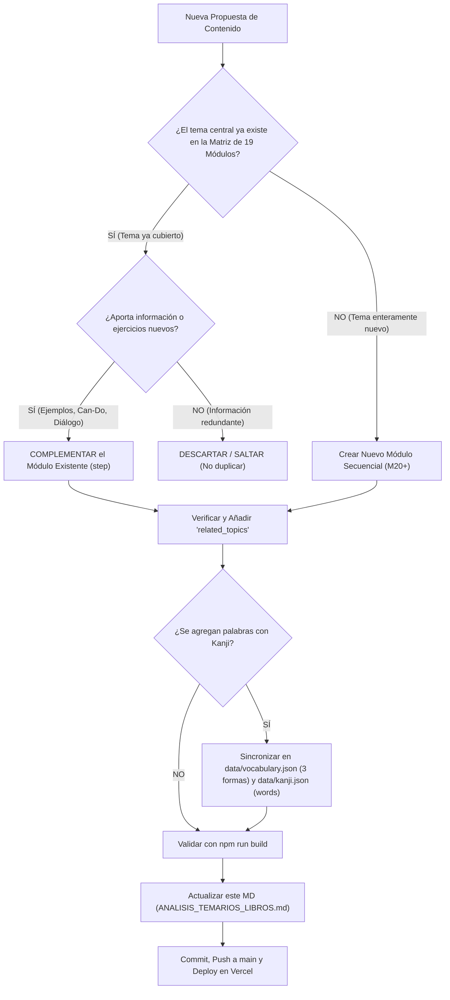

# Registro Maestro y Cuaderno de Seguimiento Curricular — Nihongo Master
## Guía Canónica de Referencia para la Incorporación de Temas, Módulos y Ejercicios

> **Fecha de Actualización:** 29 de Septiembre de 2026  
> **Estado Global del Sistema:** ✅ **100% de los manuales base integrados y consolidados**  
> - 📘 **Japonés from Spanish (NHK World):** ✅ **48/48 Lecciones (100%)** con diálogos íntegros bilingües, notas gramaticales y **144 ejercicios interactivos** en `data/conversation_exercises.json`.  
> - 📙 **Irodori Elementary 1 (Fundación Japón):** ✅ **18/18 Lecciones (100%)** con sus **79 Objetivos Can-Do**, 24 kanjis clave incorporados en `data/kanji.json` y vocabulario sincronizado.  
> - ⛩️ **Currículum Maestro:** ✅ **19 Módulos Consolidados** sin duplicidad temática, con **87 Can-Dos**, audio nativo, ejercicios por nivel y enlaces bidireccionales a **Temas Relacionados**.  
>  
> **⚠️ REGLA PRIMORDIAL:** Este documento es la **Única Fuente de Verdad pedagógica y curricular** del proyecto `Nihongo Master`. **Todo desarrollador o agente de IA DEBE consultarlo obligatoriamente antes de agregar cualquier nuevo tema, módulo o ejercicio** para garantizar la no duplicidad, la complementación de contenido y la preservación de los enlaces formativos.

---

## 1. Protocolo Canónico: ¿Cómo agregar un nuevo Tema, Módulo o Ejercicio?

Para mantener una arquitectura curricular limpia, coherente y escalable en el tiempo, rige el siguiente flujo obligatorio:



---

### 1.1. Reglas de Oro para la Incorporación de Contenido

1. **Auditoría Previa de No Duplicidad:**  
   Antes de escribir una sola línea de código o JSON, buscar en la **Sección 2 (Matriz de 19 Módulos)** por palabras clave de gramática, vocabulario o función comunicativa. Nunca debe crearse un módulo paralelo que compita sobre el mismo tópico (ej. presentaciones personales, existencia, comida, transporte o compras).
2. **Principio de Complementación:**  
   Si el tema ya existe en alguno de los 19 módulos maestros, **se debe complementar dicho módulo** agregando los nuevos ejercicios a su array `"exercises"`, los ejemplos a `"examples"` o las competencias a `"can_dos"`. Si la propuesta no aporta valor adicional o es idéntica a lo ya existente, **se omite**.
3. **Enlace Obligatorio con Temas Relacionados (`related_topics`):**  
   Todo módulo nuevo o modificado debe incorporar enlaces explícitos a sus módulos precedentes, consecutivos o complementarios, detallando:
   - `step`: Número del módulo destino.
   - `title`: Título oficial del módulo destino.
   - `icon`: Emoji distintivo.
   - `relationship`: Tipo de relación (`Precedente`, `Consecutivo Natural`, `Ampliación de Perfil`, `Complementario`, `Entorno Espacial`, etc.).
   - `reason`: Explicación pedagógica de por qué están vinculados.
4. **Destino Canónico de los Ejercicios:**  
   - **Ejercicios de comprensión de lecciones de conversación (NHK):** Se alojan en `data/conversation_exercises.json`.
   - **Ejercicios prácticos integrados de cada módulo:** Se alojan dentro del array `"exercises"` del módulo en `data/curriculum.json`.
   - **Ejercicios contextuales de rellenar huecos gramaticales:** Se alojan en `data/exercises.json`.
5. **Estructura de Tres Formas de Vocabulario y Sincronización Kanji:**  
   Toda nueva palabra debe registrarse con `kanji`, `hiragana`, `katakana`, traducción en español y nivel JLPT en `data/vocabulary.json`, y vincularse en el array `words` de cada kanji correspondiente en `data/kanji.json`.
6. **Actualización Obligatoria de este Documento:**  
   Cada adición o modificación debe registrarse de inmediato en las tablas de seguimiento de este archivo.

---

### 1.2. Plantillas y Formatos Canónicos JSON

#### A. Para un Módulo del Currículum (`data/curriculum.json`):
```json
{
  "step": 20,
  "title": "Título del Módulo en Español",
  "subtitle": "Frase canónica en japonés. (Traducción al español)",
  "icon": "🎯",
  "level": "N4",
  "stage": "Módulo 20 · Fase Temática",
  "track": "consolidated",
  "track_label": "Módulo Consolidado",
  "sourceBooks": ["Nombre del Manual Original (Págs. X-Y)"],
  "sourcePdf": "Nombre del PDF",
  "detailed_guide": "Explicación teórica profunda, contexto sociocultural y notas de uso comunicativo.",
  "objectives": [
    "Objetivo pedagógico observable 1",
    "Objetivo pedagógico observable 2"
  ],
  "can_dos": [
    {
      "id": "CD-88",
      "task": "Descripción de la competencia práctica observable",
      "sample": "Expresión japonesa modelo (ej. 日本語で話すことができます)"
    }
  ],
  "grammar_focus": [
    "Punto gramatical clave 1",
    "Punto gramatical clave 2"
  ],
  "included_vocab": ["単語1", "単語2"],
  "vocab_details": [
    {
      "kanji": "単語",
      "kana": "たんご",
      "meaning": "palabra / vocabulario",
      "type": "Sustantivo"
    }
  ],
  "examples": [
    {
      "jp": "日本語の単語を覚えます。",
      "kana": "にほんごのたんごをおぼえます。",
      "romaji": "Nihongo no tango o oboemasu.",
      "es": "Memorizo palabras en japonés.",
      "explanation": "Uso de la partícula acusativa を con el verbo transitivo 覚えます."
    }
  ],
  "exercises": [
    {
      "id": "m20_ex1",
      "question": "Selecciona la opción correcta:",
      "sentence": "毎日単語を [___]。",
      "options": ["覚えます", "食べます", "行きます", "寝ます"],
      "correct": "覚えます",
      "explanation": "El verbo adecuado para memorizar o aprender vocabulario es 覚えます."
    }
  ],
  "related_topics": [
    {
      "step": 1,
      "title": "Saludos, Cortesía y Presentación Personal",
      "icon": "🤝",
      "relationship": "Precedente",
      "reason": "Justificación pedagógica del enlace."
    }
  ]
}
```

#### B. Para un Ejercicio Conversacional (`data/conversation_exercises.json`):
```json
{
  "id": "conv_ex_49_1",
  "lesson_id": 49,
  "type": "reply",
  "question": "¿Qué debes responder ante este comentario?",
  "prompt": "Anna dice: 「はじめまして、よろしくお願いします。」",
  "sentence": "こちらこそ、[___]。",
  "options": [
    "よろしくお願いします",
    "さようなら",
    "いただきます",
    "ごちそうさまでした"
  ],
  "correct": "よろしくお願いします",
  "explanation": "Ante la fórmula de cortesía よろしくお願いします, se responde recíprocamente こちらこそ、よろしくお願いします (Mucho gusto igualmente)."
}
```

---

## 2. Matriz Maestra de Seguimiento: Los 19 Módulos Consolidados

Esta matriz representa la **estructura nuclear de la aplicación**. Ningún contenido nuevo puede solaparse con estos 19 tópicos:

| Mód. | Título Central | Nivel | Can-Dos | Fuentes Integradas | Temas Relacionados Enlazados | Estado en App |
| :---: | :--- | :---: | :---: | :--- | :--- | :---: |
| **M1** | **Saludos, Cortesía y Presentación Personal**<br>*(はじめまして。私はアンナです)* | N5 | 8 (CD 1-4, 8-11) | Irodori L1, L3 · NHK L1-2 · JLPT N1 | 🔗 **M2** (Comunicación), **M3** (Familia), **M19** (Metas) | ✅ 100% |
| **M2** | **Estrategias de Comunicación y Gestión de Idiomas**<br>*(すみません、もう一度ゆっくりお願いします)* | N5 | 3 (CD 5-7) | Irodori L2 · NHK L8 | 🔗 **M1** (Saludos), **M9** (Instrucciones Trabajo) | ✅ 100% |
| **M3** | **Identidad, Familia, Residencia y Contacto**<br>*(東京に住んでいます。家族は3人です)* | N5 | 4 (CD 12-15) | Irodori L4 · NHK L4-6, L31 · JLPT N2 | 🔗 **M1** (Presentación), **M6** (Hogar), **M8** (Horarios) | ✅ 100% |
| **M4** | **Gustos, Preferencias Culinarias y Hábitos Diarios**<br>*(うどんが好きです。毎朝コーヒーを飲みます)* | N5 | 5 (CD 16-20) | Irodori L5 · JLPT N4 · NHK L13 | 🔗 **M5** (Restaurantes), **M8** (Rutinas Diarias) | ✅ 100% |
| **M5** | **Restaurantes, Menús, Pedidos y Contadores**<br>*(これを2つとウーロン茶をください)* | N5 | 5 (CD 21-25) | Irodori L6 · NHK L7, L17, L34, L42 | 🔗 **M4** (Gustos), **M14** (Tiendas), **M15** (Precios/Caja) | ✅ 100% |
| **M6** | **El Hogar, Vivienda, Distribución y Electrodomésticos**<br>*(部屋が4つあります。エアコンと洗濯機があります)* | N5 | 5 (CD 26-30) | Irodori L7 · NHK L5, L14, L32 | 🔗 **M3** (Residencia), **M7** (Existencia ある/いる) | ✅ 100% |
| **M7** | **El Lugar de Trabajo, Orientación y Existencia (ある／いる)**<br>*(山田さんは2階の会議室にいます)* | N5 | 4 (CD 31-34) | Irodori L8 · JLPT N3 · NHK L3, L10, L25 | 🔗 **M6** (Hogar), **M9** (Instrucciones), **M13** (Orientación) | ✅ 100% |
| **M8** | **Rutinas, Horarios, Días de la Semana e Intervalos**<br>*(9時から5時まで働きます。水曜日は休みです)* | N5 | 4 (CD 35-38) | Irodori L9 · JLPT N2 · NHK L9 | 🔗 **M4** (Hábitos), **M9** (Horarios Trabajo), **M16** (Pasado) | ✅ 100% |
| **M9** | **Instrucciones de Trabajo, Peticiones y Reglas Laborales**<br>*(ホチキスを貸してください。ここでタバコを吸わないで)* | N5 | 5 (CD 39-43) | Irodori L10 · NHK L8, L23, L24 | 🔗 **M2** (Comunicación), **M7** (Trabajo), **M18** (Salud) | ✅ 100% |
| **M10** | **Aficiones, Tiempo Libre, Ocio y Redes Sociales**<br>*(休みの日は何をしますか？マンガを読んだりします)* | N5 | 4 (CD 44-47) | Irodori L11 · NHK L11, L20 | 🔗 **M4** (Gustos), **M11** (Eventos), **M16** (Experiencias) | ✅ 100% |
| **M11** | **Eventos, Festivales, Invitaciones y Propuestas**<br>*(今週の土曜日、いっしょにお祭りに行きませんか？)* | N5 | 4 (CD 48-51) | Irodori L12 · NHK L26, L27, L41 | 🔗 **M10** (Aficiones), **M12** (Transporte), **M13** (Citas) | ✅ 100% |
| **M12** | **Movilidad, Transporte Público y Estaciones**<br>*(この電車は新宿に行きますか？何番線ですか？)* | N5 | 5 (CD 52-56) | Irodori L13 · JLPT N5 · NHK L12, L16, L28 | 🔗 **M11** (Eventos), **M13** (Ciudad), **M17** (Viajes) | ✅ 100% |
| **M13** | **Orientación Urbana, Puntos de Encuentro y Señalización**<br>*(交差点を右に曲がってください。大きなビルの前です)* | N5 | 4 (CD 57-60) | Irodori L14 · NHK L18, L38 | 🔗 **M7** (Demostrativos), **M12** (Metro), **M14** (Comercios) | ✅ 100% |
| **M14** | **Tiendas, Grandes Almacenes y Búsqueda de Productos**<br>*(電池がほしいんですが、何階にありますか？)* | N5 | 5 (CD 61-65) | Irodori L15 · NHK L35 | 🔗 **M5** (Restaurantes), **M13** (Orientación), **M15** (Caja) | ✅ 100% |
| **M15** | **Precios, Descuentos y Caja del Combini**<br>*(これ、いくらですか？袋はいりません)* | N5 | 5 (CD 66-70) | Irodori L16 · NHK L35, L42 | 🔗 **M8** (Números), **M14** (Tiendas) | ✅ 100% |
| **M16** | **Fin de Semana, Relatar el Pasado y Experiencias de Ocio**<br>*(週末はどうでしたか？映画を見ました)* | N5 | 5 (CD 71-75) | Irodori L17 · JLPT N6, N7 | 🔗 **M8** (Rutinas), **M10** (Aficiones), **M17** (Vacaciones) | ✅ 100% |
| **M17** | **Planes Vacacionales, Deseos y Cultura Onsen**<br>*(次の休みに温泉に行きたいです。富士山に登りたい)* | N5 - N4 | 4 (CD 76-79) | Irodori L18 · NHK L29-30, L33, L37 · JLPT N8 | 🔗 **M12** (Transporte), **M16** (Pasado), **M19** (Metas) | ✅ 100% |
| **M18** | **Salud, Síntomas Corporales y Deberes Ineludibles**<br>*(頭が痛いです。病院へ行かなければなりません)* | N5 - N4 | 4 (CD 80-83) | NHK L19, L22, L36, L39-40 · JLPT N9 | 🔗 **M9** (Reglas Laborales y Bajas), **M14** (Farmacias) | ✅ 100% |
| **M19** | **Metas Personales, Despedidas y Expresiones de Gratitud**<br>*(日本語が上手になりたいです。大変お世話になりました)* | N5 - N4 | 4 (CD 84-87) | NHK L21, L26, L43, L47-48 · JLPT N8-9 | 🔗 **M1** (Saludos Iniciales), **M17** (Deseos con 〜たい) | ✅ 100% |

---

## 3. Seguimiento Detallado: Japonés from Spanish (NHK World — 48 Lecciones)

Curso situacional oficial de 48 lecciones protagonizado por Anna. **Estado global: 100% integrado en `data/nhk_lessons.json` con 144 ejercicios interactivos en `data/conversation_exercises.json`**.

| Lecc. | Título en Japonés y Romaji | Foco Gramatical / Estructura | Módulo Maestro Consolidado | Ejercicios Interactivos Registrados | Estado |
| :---: | :--- | :--- | :---: | :---: | :---: |
| **1** | はじめまして。私はアンナです。<br>*(WATASHI WA ANNA DESU)* | Cópula です, partícula temática は | **Módulo 1** | `conv_ex_1_1`, `conv_ex_1_2`, `conv_ex_1_3` | ✅ Completo |
| **2** | これは何ですか。<br>*(KORE WA NAN DESU KA)* | Demostrativos de objetos これ, それ, あれ | **Módulo 1** | `conv_ex_2_1`, `conv_ex_2_2`, `conv_ex_2_3` | ✅ Completo |
| **3** | トイレはどこですか。<br>*(TOIRE WA DOKO DESU KA)* | Demostrativos de lugar ここ, そこ, あそこ, どこ | **Módulo 7** | `conv_ex_3_1`, `conv_ex_3_2`, `conv_ex_3_3` | ✅ Completo |
| **4** | ただいま。<br>*(TADAIMA)* | Negación de identidad ではありません / じゃありません | **Módulo 3** | `conv_ex_4_1`, `conv_ex_4_2`, `conv_ex_4_3` | ✅ Completo |
| **5** | それは私の宝物です。<br>*(SORE WA WATASHI NO TAKARAMONO DESU)* | Partícula conectiva y posesiva の (N1 + の + N2) | **Módulo 3** | `conv_ex_5_1`, `conv_ex_5_2`, `conv_ex_5_3` | ✅ Completo |
| **6** | 電話番号は何番ですか。<br>*(DENWABANGÔ WA NANBAN DESU KA)* | Interrogativo 何番 y números de teléfono | **Módulo 3** | `conv_ex_6_1`, `conv_ex_6_2`, `conv_ex_6_3` | ✅ Completo |
| **7** | シュークリームはありますか。<br>*(SHÛKURÎMU WA ARIMASU KA)* | Existencia de cosas inanimadas (ありますか) y peticiones (をください) | **Módulo 5** | `conv_ex_7_1`, `conv_ex_7_2`, `conv_ex_7_3` | ✅ Completo |
| **8** | もう一度お願いします。<br>*(MÔICHIDO ONEGAI SHIMASU)* | Peticiones con 〜てください / 〜お願いします | **Módulo 2** | `conv_ex_8_1`, `conv_ex_8_2`, `conv_ex_8_3` | ✅ Completo |
| **9** | 何時からですか。<br>*(NANJI KARA DESU KA)* | Horas con 何時 e intervalos con から y まで | **Módulo 8** | `conv_ex_9_1`, `conv_ex_9_2`, `conv_ex_9_3` | ✅ Completo |
| **10** | 全員いますか。<br>*(ZEN-IN IMASU KA)* | Existencia de seres animados con います / いません | **Módulo 7** | `conv_ex_10_1`, `conv_ex_10_2`, `conv_ex_10_3` | ✅ Completo |
| **11** | ぜひ来てください。<br>*(ZEHI KITE KUDASAI)* | Adverbio de convite ぜひ + petición 〜てください | **Módulo 10** | `conv_ex_11_1`, `conv_ex_11_2`, `conv_ex_11_3` | ✅ Completo |
| **12** | いつ日本に来ましたか。<br>*(ITSU NIHON NI KIMASHITA KA)* | Pasado verbal 〜ました e interrogativo temporal いつ | **Módulo 12** | `conv_ex_12_1`, `conv_ex_12_2`, `conv_ex_12_3` | ✅ Completo |
| **13** | 小説が好きです。<br>*(SHÔSETSU GA SUKI DESU)* | Expresión de gustos con [Objeto] が 好きです | **Módulo 4** | `conv_ex_13_1`, `conv_ex_13_2`, `conv_ex_13_3` | ✅ Completo |
| **14** | ここにゴミを捨ててもいいですか。<br>*(KOKO NI GOMI O SUTETE MO II DESU KA)* | Pedir permiso con la forma 〜てもいいですか | **Módulo 6** | `conv_ex_14_1`, `conv_ex_14_2`, `conv_ex_14_3` | ✅ Completo |
| **15** | 寝ています。<br>*(NETE IMASU)* | Acción continua / progresiva con 〜ています | **Módulo 3** | `conv_ex_15_1`, `conv_ex_15_2`, `conv_ex_15_3` | ✅ Completo |
| **16** | 階段を上がって、右に行ってください。<br>*(KAIDAN O AGATTE, MIGI NI ITTE KUDASAI)* | Conexión de verbos en secuencia con forma て | **Módulo 12** | `conv_ex_16_1`, `conv_ex_16_2`, `conv_ex_16_3` | ✅ Completo |
| **17** | おすすめは何ですか。<br>*(OSUSUME WA NAN DESU KA)* | Preguntar por recomendaciones culinarias | **Módulo 5** | `conv_ex_17_1`, `conv_ex_17_2`, `conv_ex_17_3` | ✅ Completo |
| **18** | 道に迷ってしまいました。<br>*(MICHI NI MAYOTTE SHIMAIMASHITA)* | Acción involuntaria con 〜てしまいました | **Módulo 13** | `conv_ex_18_1`, `conv_ex_18_2`, `conv_ex_18_3` | ✅ Completo |
| **19** | よかった。<br>*(YOKATTA)* | Pasado de adjetivos-い (いい → よかった) | **Módulo 18** | `conv_ex_19_1`, `conv_ex_19_2`, `conv_ex_19_3` | ✅ Completo |
| **20** | 日本の歌を歌ったことがありますか。<br>*(NIHON NO UTA O UTATTA KOTO GA ARIMASU KA)* | Experiencia pasada con [Verbo た] + ことがある | **Módulo 10** | `conv_ex_20_1`, `conv_ex_20_2`, `conv_ex_20_3` | ✅ Completo |
| **21** | いいえ、それほどでも。<br>*(IIE, SOREHODODEMO)* | Fórmulas de modestia japonesa ante elogios | **Módulo 19** | `conv_ex_21_1`, `conv_ex_21_2`, `conv_ex_21_3` | ✅ Completo |
| **22** | 遅くなりました。<br>*(OSOKU NARIMASHITA)* | Cambio de estado con adjetivos: 〜く なりました | **Módulo 18** | `conv_ex_22_1`, `conv_ex_22_2`, `conv_ex_22_3` | ✅ Completo |
| **23** | お母さんに叱られました。<br>*(OKÂSAN NI SHIKARAREMASHITA)* | **Voz Pasiva:** [Sujeto] に [Verbo pasivo 〜られました] | **Módulo 9** | `conv_ex_23_1`, `conv_ex_23_2`, `conv_ex_23_3` | ✅ Completo |
| **24** | 使わないでください。<br>*(TSUKAWANAIDE KUDASAI)* | **Petición Negativa:** [Verbo ない] + でください | **Módulo 9** | `conv_ex_24_1`, `conv_ex_24_2`, `conv_ex_24_3` | ✅ Completo |
| **25** | 机の下に入れ。<br>*(TSUKUE NO SHITA NI HAIRE)* | **Modo Imperativo directo:** Órdenes (入れ, 逃げろ) | **Módulo 7** | `conv_ex_25_1`, `conv_ex_25_2`, `conv_ex_25_3` | ✅ Completo |
| **26** | 次はがんばろう。<br>*(TSUGI WA GANBARÔ)* | **Modo Volitivo informal:** 〜おう / 〜よう | **Módulo 19** | `conv_ex_26_1`, `conv_ex_26_2`, `conv_ex_26_3` | ✅ Completo |
| **27** | 誰が結婚するんですか。<br>*(DARE GA KEKKON SURU N DESU KA)* | **Construcción explicativa:** 〜んですか | **Módulo 11** | `conv_ex_27_1`, `conv_ex_27_2`, `conv_ex_27_3` | ✅ Completo |
| **28** | 静岡へようこそ。<br>*(SHIZUOKA E YÔKOSO)* | Bienvenida y partícula de dirección へ | **Módulo 12** | `conv_ex_28_1`, `conv_ex_28_2`, `conv_ex_28_3` | ✅ Completo |
| **29** | 近くで見ると、大きいですね。<br>*(CHIKAKU DE MIRU TO, ÔKII DESU NE)* | **Condicional natural con 〜と:** Causa-efecto inmediata | **Módulo 17** | `conv_ex_29_1`, `conv_ex_29_2`, `conv_ex_29_3` | ✅ Completo |
| **30** | もう少し写真を撮りたいです。<br>*(MÔ SUKOSHI SHASHIN O TORITAI DESU)* | **Deseo de acción:** [Verbo raíz] + 〜たいです | **Módulo 17** | `conv_ex_30_1`, `conv_ex_30_2`, `conv_ex_30_3` | ✅ Completo |
| **31** | もう82歳ですよ。<br>*(MÔ HACHIJÛNI SAI DESU YO)* | Partícula informativa よ y adverbio もう | **Módulo 3** | `conv_ex_31_1`, `conv_ex_31_2`, `conv_ex_31_3` | ✅ Completo |
| **32** | 布団のほうが好きです。<br>*(FUTON NO HÔ GA SUKI DESU)* | **Comparación de preferencia:** A のほうが (B より) 好き | **Módulo 6** | `conv_ex_32_1`, `conv_ex_32_2`, `conv_ex_32_3` | ✅ Completo |
| **33** | アンナさんにあげます。<br>*(ANNA-SAN NI AGEMASU)* | **Verbos de entrega y recepción:** あげる, くれる, もらう | **Módulo 17** | `conv_ex_33_1`, `conv_ex_33_2`, `conv_ex_33_3` | ✅ Completo |
| **34** | 柔らかくておいしいです。<br>*(YAWARAKAKUTE OISHII DESU)* | **Unión de Adjetivos-い:** Reemplazo por 〜くて | **Módulo 5** | `conv_ex_34_1`, `conv_ex_34_2`, `conv_ex_34_3` | ✅ Completo |
| **35** | クレジットカードは使えますか。<br>*(KUREJITTO KÂDO WA TSUKAEMASU KA)* | **Forma Potencial:** Capacidad de hacer algo (使えます) | **Módulo 14** | `conv_ex_35_1`, `conv_ex_35_2`, `conv_ex_35_3` | ✅ Completo |
| **36** | 勉強しなければなりません。<br>*(BENKYÔ SHINAKEREBA NARIMASEN)* | **Obligación ineludible:** Forma 〜なければなりません | **Módulo 18** | `conv_ex_36_1`, `conv_ex_36_2`, `conv_ex_36_3` | ✅ Completo |
| **37** | 富士山を見たり、お寿司を食べたりしました。<br>*(FUJISAN O MITARI, OSUSHI O TABETARI SHIMASHITA)* | **Acciones no exhaustivas:** Forma 〜たり 〜たりします | **Módulo 17** | `conv_ex_37_1`, `conv_ex_37_2`, `conv_ex_37_3` | ✅ Completo |
| **38** | かしこまりました。<br>*(KASHIKOMARIMASHITA)* | **Lenguaje formal de servicio / Keigo básico** | **Módulo 13** | `conv_ex_38_1`, `conv_ex_38_2`, `conv_ex_38_3` | ✅ Completo |
| **39** | 風邪だと思います。<br>*(KAZE DA TO OMOIMASU)* | **Expresión de opinión:** Estilo informal + と思います | **Módulo 18** | `conv_ex_39_1`, `conv_ex_39_2`, `conv_ex_39_3` | ✅ Completo |
| **40** | 頭がずきずきします。<br>*(ATAMA GA ZUKIZUKI SHIMASU)* | **Onomatopeyas físicas de síntomas:** ずきずき, ぺこぺこ | **Módulo 18** | `conv_ex_40_1`, `conv_ex_40_2`, `conv_ex_40_3` | ✅ Completo |
| **41** | 学園祭に行くことができて、楽しかったです。<br>*(GAKUEN-SAI NI IKU KOTO GA DEKITE, TANOSHIKATTA DESU)* | Nominalización con ことができる y conector causal en -て | **Módulo 11** | `conv_ex_41_1`, `conv_ex_41_2`, `conv_ex_41_3` | ✅ Completo |
| **42** | どれが一番おいしいかな。<br>*(DORE GA ICHIBAN OISHII KANA)* | Superlativo con 一番 y partícula reflexiva かな | **Módulo 15** | `conv_ex_42_1`, `conv_ex_42_2`, `conv_ex_42_3` | ✅ Completo |
| **43** | どうしてでしょうか。<br>*(DÔSHITE DESHÔ KA)* | Pregunta formal atenuada de conjetura con でしょうか | **Módulo 19** | `conv_ex_43_1`, `conv_ex_43_2`, `conv_ex_43_3` | ✅ Completo |
| **44** | 和菓子を食べてから、抹茶を飲みます。<br>*(WAGASHI O TABETE KARA, MACCHA O NOMIMASU)* | **Secuencia temporal:** Forma 〜てから (Después de...) | **Módulo 5** | `conv_ex_44_1`, `conv_ex_44_2`, `conv_ex_44_3` | ✅ Completo |
| **45** | お誕生日おめでとう。<br>*(OTANJÔBI OMEDETÔ)* | Felicitaciones y cortesía en celebraciones | **Módulo 10** | `conv_ex_45_1`, `conv_ex_45_2`, `conv_ex_45_3` | ✅ Completo |
| **46** | 帰国する前に、雪を見ることができて幸せです。<br>*(KIKOKU SURU MAE NI...)* | Construcción temporal: Forma diccionario + 前に | **Módulo 12** | `conv_ex_46_1`, `conv_ex_46_2`, `conv_ex_46_3` | ✅ Completo |
| **47** | 日本語教師になるのが夢です。<br>*(NIHONGO-KYÔSHI NI NARU NO GA YUME DESU)* | Nominalización de acciones con の / こと | **Módulo 19** | `conv_ex_47_1`, `conv_ex_47_2`, `conv_ex_47_3` | ✅ Completo |
| **48** | いろいろお世話になりました。<br>*(IROIRO OSEWA NI NARIMASHITA)* | Expresión canónica japonesa de agradecimiento final | **Módulo 19** | `conv_ex_48_1`, `conv_ex_48_2`, `conv_ex_48_3` | ✅ Completo |

---

## 4. Seguimiento Detallado: Irodori Elementary 1 (18 Lecciones y 79 Can-Dos)

El manual oficial de la Fundación Japón enfocado en la integración laboral y comunitaria en Japón. **Estado global: 100% de los 79 Can-Dos integrados en los 19 Módulos Maestros con audio y ejercicios**.

### Distribución por Tópicos y Can-Dos:

```
Tópico 1: はじめての日本語 (L1, L2)            --> Can-Dos 01 a 07 (7 Can-Dos)  --> Módulos 1 y 2
Tópico 2: 私のこと (L3, L4)                   --> Can-Dos 08 a 15 (8 Can-Dos)  --> Módulos 1 y 3
Tópico 3: 好きな食べ物 (L5, L6)                --> Can-Dos 16 a 25 (10 Can-Dos) --> Módulos 4 y 5
Tópico 4: 家と職場 (L7, L8)                   --> Can-Dos 26 a 34 (9 Can-Dos)  --> Módulos 6 y 7
Tópico 5: 毎日の生活 (L9, L10)                 --> Can-Dos 35 a 43 (9 Can-Dos)  --> Módulos 8 y 9
Tópico 6: 私の好きなこと (L11, L12)            --> Can-Dos 44 a 51 (8 Can-Dos)  --> Módulos 10 y 11
Tópico 7: 街を歩く (L13, L14)                  --> Can-Dos 52 a 60 (9 Can-Dos)  --> Módulos 12 y 13
Tópico 8: 店で (L15, L16)                     --> Can-Dos 61 a 70 (10 Can-Dos) --> Módulos 14 y 15
Tópico 9: 休みの日に (L17, L18)                --> Can-Dos 71 a 79 (9 Can-Dos)  --> Módulos 16 y 17
NHK Complementario: Salud y Metas             --> Can-Dos 80 a 87 (8 Can-Dos)  --> Módulos 18 y 19
------------------------------------------------------------------------------------------------------
TOTAL CAN-DOS INTEGRADOS EN NIHONGO MASTER    --> 87 CAN-DOS ACTIVOS
```

#### Catálogo Completo de Can-Dos Oficiales:

| Código | Tarea Comunicativa Observable (Can-Do) | Expresión Japonesa de Muestra | Módulo Asignado |
| :---: | :--- | :--- | :---: |
| **CD-01** | Saludar al encontrarse con alguien según el momento del día | おはようございます / こんにちは / こんばんは | **Módulo 1** |
| **CD-02** | Despedirse al retirarse o terminar la jornada laboral | お先に失礼します / お疲れさまでした / 失礼します | **Módulo 1** |
| **CD-03** | Agradecer y pedir disculpas en situaciones concretas | ありがとうございます / すみません | **Módulo 1** |
| **CD-04** | Comprender sellos y stickers de mensajería digital | よろしくお願いします / 了解です | **Módulo 1** |
| **CD-05** | Pedir que repitan o hablen más despacio cuando no se comprende | すみません、もう一度ゆっくりお願いします | **Módulo 2** |
| **CD-06** | Indicar qué idiomas se hablan y preguntar a otros | 英語ができます / 日本語は少しできます | **Módulo 2** |
| **CD-07** | Preguntar cómo se dice un objeto o palabra en japonés | これは日本語で何と言いますか？ | **Módulo 2** |
| **CD-08** | Presentarse brevemente indicando nombre, país y ocupación | はじめまして。アンナです。タイから来ました。 | **Módulo 1** |
| **CD-09** | Escribir nombre y procedencia en tarjetas de identificación | 名前：アンナ / 国：タイ | **Módulo 1** |
| **CD-10** | Preguntar y responder sobre el lugar de procedencia | ご出身はどちらですか？ / バンコクです。 | **Módulo 1** |
| **CD-11** | Rellenar formularios de registro oficial (nombre, fecha nacimiento) | 氏名、生年月日、国籍の記入 | **Módulo 1** |
| **CD-12** | Comprender la presentación de los miembros de una familia | 父と母と弟の4人家族です。 | **Módulo 3** |
| **CD-13** | Preguntar y decir el lugar de residencia actual y la edad | 東京に住んでいます。22歳です。 | **Módulo 3** |
| **CD-14** | Comentar y hacer preguntas sobre fotos familiares o de mascotas | これは私の母です。犬のポチです。 | **Módulo 3** |
| **CD-15** | Leer publicaciones breves de amigos en redes sociales con imágenes | 友だちと遊びました。楽しかったです！ | **Módulo 3** |
| **CD-16** | Responder preguntas sobre preferencias culinarias | うどんが好きです。野菜もよく食べます。 | **Módulo 4** |
| **CD-17** | Expresar educadamente qué comidas o ingredientes no se pueden tomar | わさびは、ちょっと苦手です… | **Módulo 4** |
| **CD-18** | Ofrecer o aceptar bebidas amablemente | お茶を飲みますか？ / いただきます。 | **Módulo 4** |
| **CD-19** | Describir los hábitos cotidianos del desayuno | 毎朝パンとコーヒーを飲みます。 | **Módulo 4** |
| **CD-20** | Escribir un pie de foto sencillo sobre comida para redes | 今日のランチはラーメンです。 | **Módulo 4** |
| **CD-21** | Leer un menú con imágenes en un local de comida rápida | チーズバーガー、ポテト、コーラ | **Módulo 5** |
| **CD-22** | Hacer un pedido para consumir en el local o para llevar | 店内でお召し上がりですか？ / 持ち帰りで。 | **Módulo 5** |
| **CD-23** | Decidir qué pedir en grupo y consensuar la comanda | 私はこれにします。みんなでピザを食べよう。 | **Módulo 5** |
| **CD-24** | Pedir cantidades exactas de platos o bebidas en una izakaya | 枝豆をひとつと、ビールを2つください。 | **Módulo 5** |
| **CD-25** | Reconocer rótulos y carteles callejeros de locales de restauración | 居酒屋、ラーメン屋、喫茶店、定食 | **Módulo 5** |
| **CD-26** | Comprender explicaciones sobre la distribución de un apartamento | 部屋が4つあります。キッチンは広いです。 | **Módulo 6** |
| **CD-27** | Preguntar si una vivienda cuenta con electrodomésticos clave | エアコンや洗濯機はありますか？ | **Módulo 6** |
| **CD-28** | Describir características y comodidades de la casa | 静かで日当たりがいい部屋です。 | **Módulo 6** |
| **CD-29** | Hablar sobre el tipo de vivienda en el que se habita | アパートの一人暮らしです。社宅です。 | **Módulo 6** |
| **CD-30** | Leer los botones esenciales de electrodomésticos japoneses | 冷房、暖房、除湿、停止、スタート | **Módulo 6** |
| **CD-31** | Entender un recorrido guiado por las instalaciones de la empresa | ここが会議室で、あそこが食堂です。 | **Módulo 7** |
| **CD-32** | Preguntar y responder sobre la ubicación de compañeros de trabajo | 山田さんはどこにいますか？ / 2階の事務室です。 | **Módulo 7** |
| **CD-33** | Preguntar y responder dónde están almacenados los materiales | はさみはあの引き出しの中にあります。 | **Módulo 7** |
| **CD-34** | Leer carteles y placas en las puertas de oficinas y salas | 休憩室、給湯室、倉庫、非常口 | **Módulo 7** |
| **CD-35** | Preguntar y decir a qué hora nos levantamos, comemos o descansamos | 毎朝7時に起きます。12時に昼ご飯を食べます。 | **Módulo 8** |
| **CD-36** | Comprender la explicación de los turnos y el horario laboral | 9時から18時まで勤務です。土日は休みです。 | **Módulo 8** |
| **CD-37** | Leer el tablero de planificación y turnos del equipo | ホワイトボードの予定表を読む | **Módulo 8** |
| **CD-38** | Proponer y acordar días u horas convenientes para una reunión | 金曜日の午後3時はどうですか？ / いいですね。 | **Módulo 8** |
| **CD-39** | Escuchar instrucciones de trabajo y comprender la tarea requerida | この書類を5枚コピーしてください。 | **Módulo 9** |
| **CD-40** | Confirmar datos y pedir que repitan un punto laboral | すみません、いくつ必要ですか？ | **Módulo 9** |
| **CD-41** | Leer notas breves manuscritas dejadas por compañeros | 「田中さんへ：電話がありました」を読む | **Módulo 9** |
| **CD-42** | Pedir prestadas herramientas u objetos a compañeros de trabajo | ホチキスを貸してください。 / 充電器ありますか？ | **Módulo 9** |
| **CD-43** | Cotejar un checklist de materiales y verificar que no falte nada | 点検リストをチェックして確認する | **Módulo 9** |
| **CD-44** | Hablar sobre aficiones personales e intereses en el tiempo libre | 趣味は音楽を聴くことです。サッカーをします。 | **Módulo 10** |
| **CD-45** | Preguntar por géneros, autores u obras predilectas | どんなマンガが好きですか？ / アニメも見ます。 | **Módulo 10** |
| **CD-46** | Describir qué se suele hacer los fines de semana libres | 家でゆっくり映画を見たりします。 | **Módulo 10** |
| **CD-47** | Leer perfiles breves de amigos en redes sociales | プロフィール文の趣味や自己紹介を読む | **Módulo 10** |
| **CD-48** | Leer folletos de eventos públicos (fecha, hora y lugar) | 夏祭りのチラシを読む（日時・場所） | **Módulo 11** |
| **CD-49** | Preguntar si alguien asistirá a un festival o salida | 今週末の花火大会に行きますか？ | **Módulo 11** |
| **CD-50** | Invitar cordialmente a planes de ocio y aceptar con entusiasmo | いっしょに行きませんか？ / ぜひ行きましょう！ | **Módulo 11** |
| **CD-51** | Escribir mensajes aceptando o declinando invitaciones con tacto | その日はちょっと用事があって…また誘ってください。 | **Módulo 11** |
| **CD-52** | Preguntar si un autobús o tren se dirige a nuestro destino | このバスは空港に行きますか？ / 3番乗り場です。 | **Módulo 12** |
| **CD-53** | Entender anuncios de megafonía de próximas paradas en el tren | 「次は新宿、新宿です。お出口は右側です」 | **Módulo 12** |
| **CD-54** | Explicar el medio de transporte usado y el tiempo de traslado | 電車で通っています。40分くらいかかります。 | **Módulo 12** |
| **CD-55** | Preguntar cómo llegar a un edificio público o estación | 市役所へはどう行けばいいですか？ | **Módulo 12** |
| **CD-56** | Interpretar señalización y pictogramas de estaciones | 改札口、切符売り場、乗り換え、東口、西口 | **Módulo 12** |
| **CD-57** | Preguntar por cajeros ATM o aseos en la calle | この近くにATMはありますか？ | **Módulo 13** |
| **CD-58** | Describir por teléfono la propia ubicación exacta al quedar | 今、ハチ公前の交差点の近くにいます。 | **Módulo 13** |
| **CD-59** | Expresar asombro e impresiones al recorrer una zona urbana | 大きなビルですね！人がたくさんいますね。 | **Módulo 13** |
| **CD-60** | Leer carteles de comercios para saber si están abiertos o cerrados | 営業中、準備中、定休日、本日休業 | **Módulo 13** |
| **CD-61** | Preguntar en qué tienda o sección encontrar un producto | 電池がほしいんですが、どこで買えますか？ | **Módulo 14** |
| **CD-62** | Interpretar directorios de plantas (*floor guides*) de tiendas | 3階：家電・文房具、地下1階：食料品 | **Módulo 14** |
| **CD-63** | Preguntar al dependiente en qué planta está un departamento | 文房具は何階ですか？ / 5階にございます。 | **Módulo 14** |
| **CD-64** | Comentar artículos con amigos de compras de forma espontánea | わあ、これかわいい！ちょっと高そうですね。 | **Módulo 14** |
| **CD-65** | Comprender la señalización de puertas comerciales | 押す（PUSH）、引く（PULL）、自動ドア | **Módulo 14** |
| **CD-66** | Comprender con precisión el precio total anunciado por el cajero | お会計は3,450円になります。 | **Módulo 15** |
| **CD-67** | Preguntar al dependiente por el precio de una mercancía | これ、いくらですか？ / 税込みで1,000円です。 | **Módulo 15** |
| **CD-68** | Solicitar cantidades de peso o unidades al pedir comida al corte | ひき肉を300グラムとコロッケを2つください。 | **Módulo 15** |
| **CD-69** | Responder a preguntas rutinarias en la caja del combini | 袋はいりません。温めをお願いします。 | **Módulo 15** |
| **CD-70** | Interpretar etiquetas de rebaja y promociones comerciales | 半額（50% OFF）、2割引（20% OFF）、セール | **Módulo 15** |
| **CD-71** | Responder de forma concisa qué se hizo durante el fin de semana | 映画を見に行きました。友だちとご飯を食べました。 | **Módulo 16** |
| **CD-72** | Preguntar y compartir impresiones sobre vivencias pasadas | 週末はどうでしたか？ / とても楽しかったです！ | **Módulo 16** |
| **CD-73** | Leer publicaciones en redes sobre salidas y actividades de ocio | 写真付きの週末の投稿を読んで理解する | **Módulo 16** |
| **CD-74** | Interpretar tablas de tarifas y precios en recintos recreativos | 入場料：大人1,500円、子ども800円 | **Módulo 16** |
| **CD-75** | Enviar mensajes breves de agradecimiento tras una salida compartida | 今日はありがとうございました。楽しかったです！ | **Módulo 16** |
| **CD-76** | Preguntar y compartir planes para vacaciones largas (Golden Week) | 次の休みに何をしますか？ / 旅行を計画しています。 | **Módulo 17** |
| **CD-77** | Responder qué actividades se desearía experimentar en Japón | 温泉に入りたいです。富士山に登ってみたいです。 | **Módulo 17** |
| **CD-78** | Publicar en redes sociales un resumen ameno de una excursión | 日帰り温泉に行きました。景色が最高でした。 | **Módulo 17** |
| **CD-79** | Narrar un viaje estructurando ideas cronológicas y contrastes | 新幹線で行きました。混んでいましたが、良かったです。 | **Módulo 17** |
| **CD-80** | Describir síntomas corporales y dolencias físicas al médico o compañeros | 頭が痛くて、熱が38度あります。喉も痛いです。 | **Módulo 18** |
| **CD-81** | Comprar medicamentos en farmacias explicando el malestar | 総合風邪薬と胃腸薬をください。 | **Módulo 18** |
| **CD-82** | Comprender indicaciones médicas de posología y reposo | 1日3回、食後に飲んで安静にしてください。 | **Módulo 18** |
| **CD-83** | Solicitar auxilio urgente y contactar con emergencias (119 / 110) | 助けてください！救急車を呼んでください！ | **Módulo 18** |
| **CD-84** | Expresar metas personales de aprendizaje y superación en japonés | 日本語がもっと上手になりたいです。JLPTに合格したい。 | **Módulo 19** |
| **CD-85** | Agradecer formalmente la acogida y enseñanzas al terminar una etapa | 大変お世話になりました。心から感謝しております。 | **Módulo 19** |
| **CD-86** | Despedirse con calidez y desear mutuo bienestar y salud | 先生もお元気で。またいつか会いましょう！ | **Módulo 19** |
| **CD-87** | Proponer mantener el contacto a través de mensajería o redes | 連絡先を教えてください。またメッセージを送ります。 | **Módulo 19** |

---

## 5. Seguimiento del Catálogo de Kanjis y Vocabulario Maestro

### 5.1. Kanjis Auditados (159 Kanjis en `data/kanji.json`)
Los 24 kanjis elementales introducidos en Irodori fueron dados de alta exitosamente, completando la cobertura de los manuales de estudio:

| # | Kanji | Significado | Lecturas On/Kun | Módulo | Palabras Sincronizadas en `words` |
| :-: | :---: | :--- | :--- | :---: | :--- |
| 1 | **私** | Yo, privado | シ / わたし | **M1** | 私 (わたし), 私立 (しりつ) |
| 2 | **肉** | Carne | ニク | **M4** | 肉 (にく), 牛肉 (ぎゅうにく), 豚肉 (ぶたにく) |
| 3 | **好** | Gustar, agradable | コウ / す・き | **M4** | 好き (すき), 大好物 (だいこうぶつ) |
| 4 | **家** | Casa, familia | カ, ケ / いえ, や | **M6** | 家 (いえ), 家族 (かぞく), 家賃 (やちん) |
| 5 | **広** | Amplio, espacioso | コウ / ひろ・い | **M6** | 広い (ひろい), 広場 (ひろば) |
| 6 | **朝** | Mañana | チョウ / あさ | **M8** | 朝 (あさ), 朝ご飯 (あさごはん), 今朝 (けさ) |
| 7 | **昼** | Mediodía, día | チュウ / ひる | **M8** | 昼 (ひる), 昼休み (ひるやすみ), 昼ご飯 (ひるごはん) |
| 8 | **夜** | Noche | ヤ / よる, よ | **M8** | 夜 (よる), 今夜 (こんや), 夜中 (よなか) |
| 9 | **枚** | Contador planos | マイ | **M9** | 1枚 (いちまい), 30枚 (さんじゅうまい) |
| 10 | **乗** | Subir/montar | ジョウ / の・る | **M12** | 乗ります (のります), 乗り場 (のりば) |
| 11 | **低** | Bajo | テイ / ひく・い | **M13** | 低い (ひくい), 最低 (さいてい) |
| 12 | **横** | Lado, horizontal | オウ / よこ | **M13** | 横 (よこ), 横断歩道 (おうだんほどう) |
| 13 | **口** | Boca, entrada | コウ, ク / くち, ぐち | **M14** | 口 (くち), 入口 (いりぐち), 出口 (でぐち) |
| 14 | **押** | Empujar | オウ / お・す | **M14** | 押す (おす), 押入れ (おしいれ) |
| 15 | **引** | Tirar, jalar | イン / ひ・く | **M15** | 引く (ひく), 引き出し (ひきだし), 割引 (わりびき) |
| 16 | **映** | Proyectar | エイ / うつ・る | **M16** | 映画 (えいが), 映る (うつる) |
| 17 | **画** | Imagen, trazo | ガ, カク | **M16** | 映画 (えいが), 画面 (がめん), 画家 (がか) |
| 18 | **勉** | Esforzarse | ベン | **M16** | 勉強 (べんきょう) |
| 19 | **強** | Fuerte | キョウ, ゴウ / つよ・い | **M16** | 勉強 (べんきょう), 強い (つよい) |
| 20 | **温** | Templado, tibio | オン / あたた・かい | **M17** | 温泉 (おんせん), 温度 (おんど) |
| 21 | **泉** | Manantial | セン / いずみ | **M17** | 温泉 (おんせん) |
| 22 | **予** | Previo | ヨ | **M17** | 予定 (よてい), 予約 (よやく) |
| 23 | **定** | Fijar, fijado | テイ, ジョウ / さだ・める | **M17** | 予定 (よてい), 定休日 (ていきゅうび) |
| 24 | **旅** | Viaje | リョ / たび | **M17** | 旅行 (りょこう), 一人旅 (ひとりたび) |

---

### 5.2. Vocabulario Maestro (208 Palabras en `data/vocabulary.json`)
Cada entrada contiene rigurosamente:
1. `kanji`: Ortografía canónica.
2. `hiragana`: Lectura fonética nativa.
3. `katakana`: Transcripción en katakana (obligatoria).
4. `meaning_es`: Significado en español.
5. `level`: Nivel JLPT correspondiente (`N5`, `N4`).

---

## 6. Inventario Global de Ejercicios y Tipologías Activas

| Categoría de Ejercicio | Archivo Fuente | Cantidad Total | Tipología / Mecánica | Puntos XP |
| :--- | :--- | :---: | :--- | :---: |
| **Conversación y Diálogo Situacional** | `data/conversation_exercises.json` | **144 ejercicios** (3 por lección NHK) | `reply` (seleccionar réplica adecuada), `missing_word` (rellenar hueco), `missing_kanji` (ortografía correcta) | +10 XP |
| **Quizzes de Módulo Curricular** | `data/curriculum.json` | **82 ejercicios** | Selección múltiple contextual basada en los Can-Dos y gramática del módulo (mínimo 3 a 7 por módulo) | +5 XP |
| **Drills Gramaticales y Contexto N4** | `data/exercises.json` | **35 ejercicios** | Rellenado de adjetivos, partículas y conjugaciones extraídos de los materiales N4 de estudio | +5 XP |
| **TOTAL EJERCICIOS ACTIVOS** | — | **261 ejercicios** | — | — |

---

---

## 8. Catálogo Integrado de Historias y Diálogos Situacionales (Irodori & NHK World)

### 8.1. Biblioteca de Historias Graduadas (`data/stories.json`)
Todas las historias cuentan con capítulos progresivos, audio Edge TTS nativo, desglose frase por frase con explicaciones gramaticales en español, modo IME Typing y quizzes de comprensión:

| ID Historia | Título (JP / ES) | Nivel JLPT | Capítulos | Frases Clave | Módulos del Currículum Vinculados |
| :--- | :--- | :---: | :---: | :---: | :--- |
| `story_1` | **日本での一日** · *Un día en Japón* | **N5** | 4 capítulos | 58 frases | **M1, M3, M5, M8** (Saludos, presentaciones, compras, rutina) |
| `story_2` | **東京での新しい暮らし** · *Nueva Vida en Tokio* | **N5** | 4 capítulos | 21 frases | **M4, M6, M12, M13, M14, M15** (Sharehouse, transporte, restaurantes, salud) |
| `story_3` | **日本での挑戦と発見** · *Desafíos y Descubrimientos* | **N4** | 5 capítulos | 12 frases | **M20, M21, M22, M23, M25, M26, M27, M28** (Autonomía, trámites, cocina, viajes) |
| `story_4` | **日本社会で生きる：夢への架け橋** · *Vivir en la Sociedad Japonesa* | **N3** | 5 capítulos | 8 frases | **M29, M30, M31, M32, M35, M36, M37** (Negocios, honoríficos, desastres, metas) |

### 8.2. Biblioteca Unificada de Conversaciones (`data/irodori_dialogues.json` y `data/nhk_lessons.json`)
Total: **70 diálogos interactivos** con modos Shadowing, Ocultar Personaje, evaluación de pronunciación por micrófono, audio neuronal multi-voz y caligrafía:
- **Irodori Situacional (Fundación Japón):** 22 diálogos de alta fidelidad organizados por escenarios de la vida real (llegada, izakaya, basura, hospital, oficina, etc.).
- **NHK World (Hablemos en Japonés):** 48 lecciones canónicas con audio original de radio y diálogos progresivos.
- **Filtros interactivos en `/nhk`:** Colección (`Todas`, `Irodori Situacional`, `NHK World`), Nivel JLPT (`Todos`, `N5`, `N4`, `N3`), Estado (`Estudiadas`, `Pendientes`) y Buscador contextual.
- **Enlace bidireccional:** Cada módulo del currículum (`/curriculum`) incluye tarjetas directas a sus diálogos e historias correspondientes, y cada diálogo/historia enlaza de vuelta a su módulo curricular.

---

## 10. Catálogo Maestro de Partículas y Gramática Esencial (`data/particles.json`)

Se completó la auditoría, consolidación y expansión exhaustiva de las partículas de la plataforma Nihongo Master, alcanzando **99 partículas estructuradas** organizadas con el estándar estricto de niveles **JLPT N5 a N1**:

### 10.1. Distribución por Nivel JLPT y Funcionalidad
| Nivel JLPT | Cantidad | Partículas y Conectores Clave | Enfoque Pedagógico |
| :---: | :---: | :--- | :--- |
| **N5** | **46** | `は`, `が`, `を`, `に`, `で`, `へ`, `と`, `も`, `から`, `まで`, `より`, `か`, `ね`, `よ`, `よね`, `や`, `など`, `までに`, `だけ`, `しか〜ない`, `くらい/ぐらい`, `ごろ`, `の`... | Casos gramaticales básicos, tema vs sujeto, objeto directo, dirección, tiempo, causa elemental, enumeración exhaustiva e inexhaustiva, y partículas discursivas de fin de oración. |
| **N4** | **19** | `ので`, `のに`, `でも`, `ば`, `たら`, `なら`, `ても`, `ながら`, `し`, `たり〜たり`, `か/かどうか`, `ばかり`, `たばかり`, `ほど`, `とおり`, `まま`, `ために`, `ように`, `やすい/にくい` | Conjunciones causales, adversativas, condicionales (`ば`, `たら`, `なら`), acciones simultáneas (`ながら`), enumeración de razones (`し`), acciones recientes (`たばかり`) y propósito (`ために`, `ように`). |
| **N3** | **22** | `にとって`, `について`, `に関して`, `に対して`, `によって`, `を通じて`, `をはじめ`, `を中心に`, `をこめて`, `にかけて`, `にわたって`, `おかげで`, `せいで`, `たびに`, `ついでに`, `最中に`, `うちに`, `向け`, `向き`, `っぽい`, `として`, `わりに` | Estructuras posicionales y abstractas: perspectiva (`にとって`), tópico formal (`について`, `に関して`), contraste/actitud (`に対して`), medio/agente (`によって`), rango espacio-temporal (`にかけて`, `にわたって`), causa positiva/negativa (`おかげで`, `せいで`), temporalidad (`最中に`, `うちに`), y roles (`として`). |
| **N2** | **8** | `にこたえて`, `に基づいて`, `に沿って`, `のもとで`, `を契機に`, `を問わず`, `にかかわらず`, `のみならず` | Gramática avanzada y formal: respuesta a expectativas (`にこたえて`), fundamentación (`に基づいて`), conformidad con pautas (`に沿って`), condiciones (`のもとで`), puntos de inflexión (`を契機に`), indiferencia de condiciones (`を問わず`, `にかかわらず`) y adición formal (`のみならず`). |
| **N1** | **4** | `はおろか`, `を余儀なくされる`, `たるもの`, `ならでは` | Estructuras formales y literarias: énfasis extremo ("ni hablar de", `はおろか`), inevitabilidad forzosa (`を余儀なくされる`), rol y deber moral (`たるもの`), y exclusividad única/inimitable (`ならでは`). |
| **TOTAL** | **99** | — | **100% Cobertura de Partículas y Conectores de Examen JLPT** |

### 10.2. Características y Prestaciones en la Interfaz (`/grammar`):
1. **Selector de Nivel JLPT:** Pestañas directas (`Todas (99)`, `N5 (46)`, `N4 (19)`, `N3 (22)`, `N2 (8)`, `N1 (4)`) con códigos de color de alto contraste.
2. **Filtrado Contextual de Símbolos:** Al seleccionar un nivel específico, el listado de botones de símbolos (`uniqueParticles`) se filtra automáticamente para mostrar solo las partículas pertenecientes a dicho nivel.
3. **Modo Quiz Adaptativo por Nivel:** El Quiz permite practicar preguntas filtrando por nivel específico (`N5`, `N4`, etc.) o de manera global (`Todas`), además de permitir filtrar por partículas pendientes o dominadas.
4. **Sincronización en URL:** Soporte nativo de parámetros de búsqueda (`?level=N5`, `?particle=は`, `?quiz=true`, `?search=...`).
5. **Fichas Didácticas Completas:** Cada una de las 99 partículas incluye su símbolo kanji/kana, rol gramatical en inglés y español, fórmula sintáctica clara, ejemplos traducidos con romaji y audio Edge TTS, botón para practicar en el cuaderno de caligrafía y speech recognition para entrenar pronunciación.

---

## 11. Checklist de Verificación Rápida para Desarrolladores y Agentes

Antes de proponer o implementar cualquier cambio en el temario, responde a estas preguntas:

- [x] **1. No Duplicidad:** ¿Revisaste la **Sección 2** de este documento y confirmaste que la temática no está ya cubierta en los Módulos 1 al 37?
- [x] **2. Complementación:** ¿Agregaste los nuevos ejemplos, Can-Dos o ejercicios directamente dentro del módulo correspondiente de `data/curriculum.json` en lugar de crear un módulo nuevo?
- [x] **3. Enlaces Temáticos:** ¿Configuraste o actualizaste el bloque `related_topics`, `related_dialogues` y `related_stories` de los módulos vinculados?
- [x] **4. Vocabulario Completo:** ¿Las palabras están registradas con sus 3 escrituras (**Kanji**, **Hiragana**, **Katakana**) y su nivel JLPT en `data/vocabulary.json`?
- [x] **5. Sincronización Kanji:** ¿Añadiste la referencia de cada palabra al array `words` de **todos los kanjis que la componen** en `data/kanji.json`?
- [x] **6. Build Check:** ¿Ejecutaste `npm run build` y verificaste que compile con 0 errores?
- [x] **7. Registro de Seguimiento:** ¿Actualizaste las tablas de este documento (`ANALISIS_TEMARIOS_LIBROS.md`) para reflejar las nuevas adiciones?
- [x] **8. Autoevaluación Can-Do y Ruta:** ¿Se encuentran implementados y operativos los checkboxes interactivos para la Ruta Consolidada y las Competencias Can-Do en la interfaz?
- [x] **9. Historias y Conversaciones:** ¿Se encuentran seccionadas por Nivel (N5 a N3) y Colección en `/story` y `/nhk` con navegación fluida?
- [x] **10. Partículas Organizadas:** ¿Se encuentran las 99 partículas estructuradas por niveles JLPT (N5 a N1) con filtros, fórmulas y quizzes por nivel en `/grammar`?
- [x] **11. Despliegue:** ¿Realizaste `git commit`, `git push origin main` y confirmaste el estado en Vercel?


