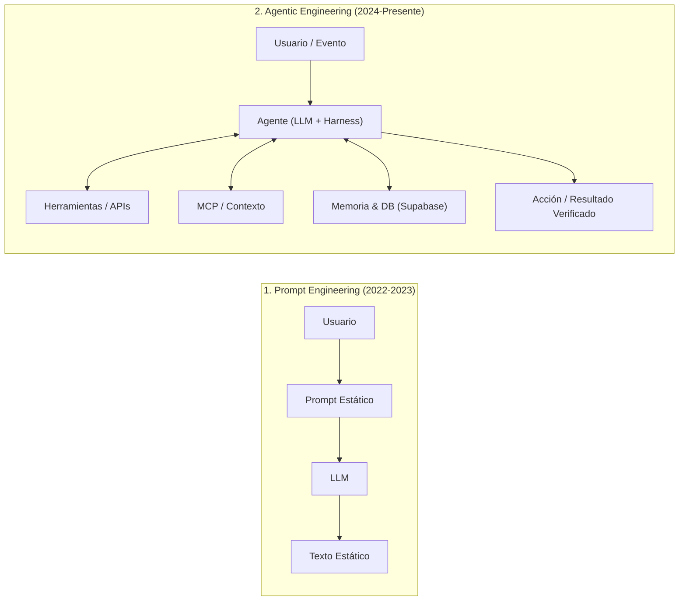
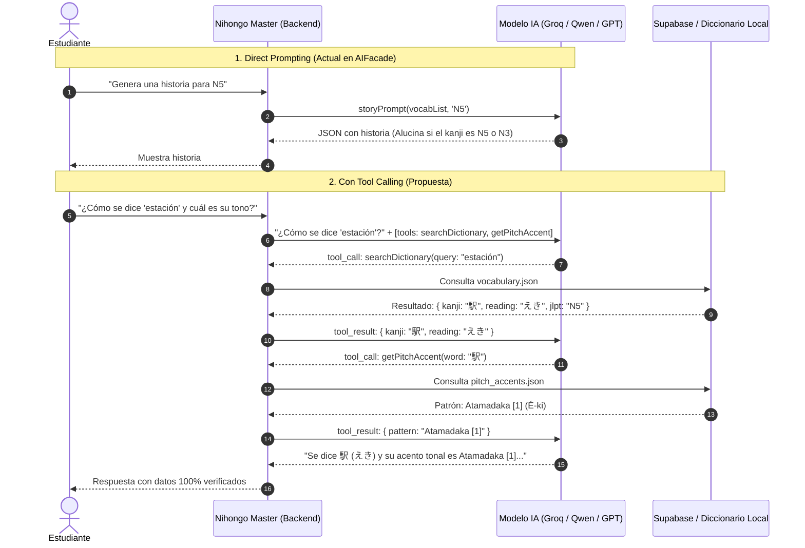
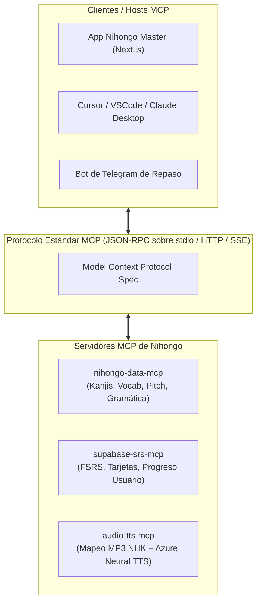
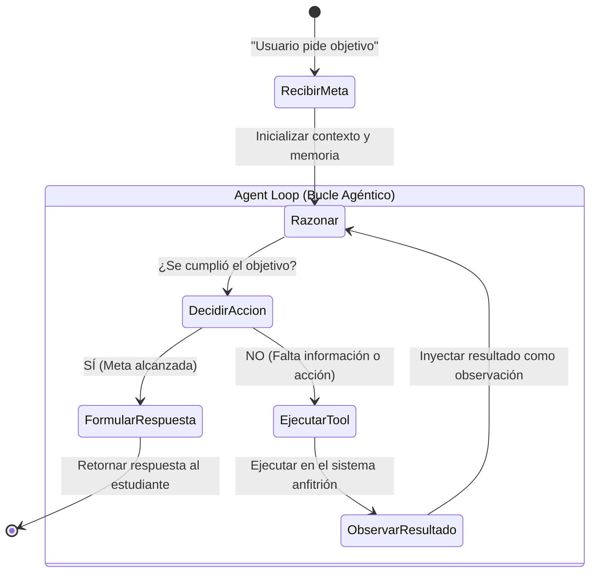
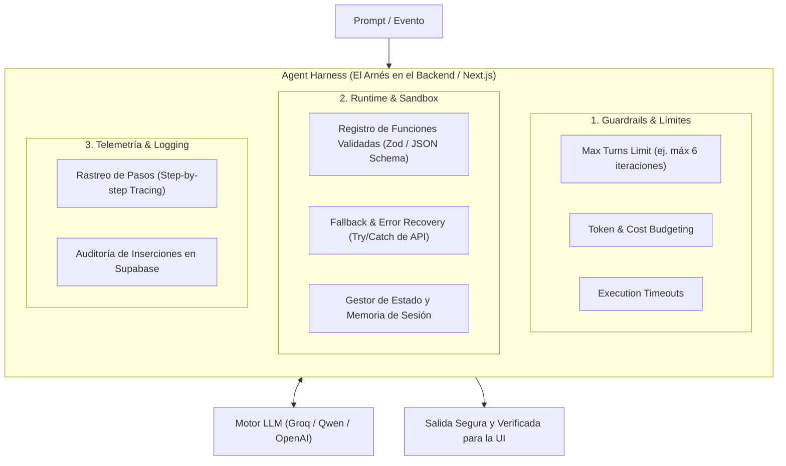
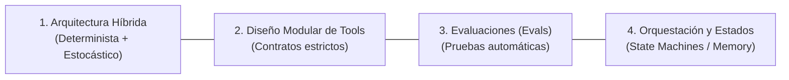
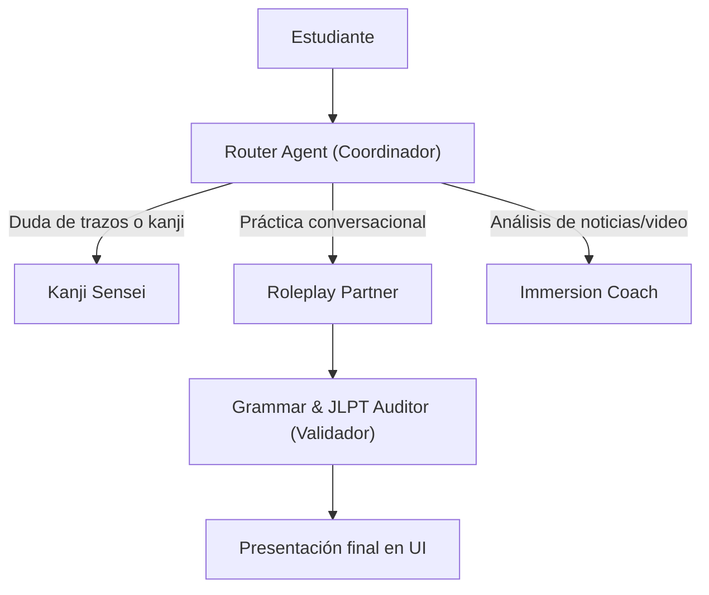

# 🧠 Guía Integral de Ingeniería Agéntica, MCP y Tool Calling
> **Aplicada al Ecosistema de Nihongo Master**

Esta guía está diseñada como material de referencia y estudio para dominar los conceptos clave de la inteligencia artificial moderna orientada a agentes (**Agentic AI**), pasando del simple *Prompt Engineering* a la **Ingeniería de Sistemas Agénticos**. Cada término incluye su fundamento teórico, un diagrama visual explicativo en Mermaid y ejemplos de aplicación directa en el proyecto **Nihongo Master**.

---

## 📑 Tabla de Contenidos
1. [De Prompt Engineering a Agentic Engineering](#1-de-prompt-engineering-a-agentic-engineering)
2. [Direct Prompting vs. Tool Calling (Function Calling)](#2-direct-prompting-vs-tool-calling-function-calling)
3. [Model Context Protocol (MCP)](#3-model-context-protocol-mcp)
4. [Agent Loop & El Patrón ReAct (Reason + Act + Observe)](#4-agent-loop--el-patrón-react)
5. [Agent Harness (El Arnés del Agente)](#5-agent-harness-el-arnés-del-agente)
6. [Ingeniería Agéntica (Agentic Engineering)](#6-ingeniería-agéntica-agentic-engineering)
7. [Términos Complementarios Esenciales](#7-términos-complementarios-esenciales)
   - *Memoria (Short-Term vs. Long-Term)*
   - *Human-in-the-Loop (HITL)*
   - *Multi-Agent Systems & Subagents*
   - *Evals & Benchmarks*
8. [Matriz de Aplicación en Nihongo Master](#8-matriz-de-aplicación-en-nihongo-master)

---

## 1. De Prompt Engineering a Agentic Engineering

En los inicios de los LLMs, el desarrollo se centraba en **Prompt Engineering**: optimizar el texto de entrada (system prompt, few-shot examples, chain-of-thought) para que el modelo generara la mejor respuesta en un solo intento (*single-shot generation*).

La **Ingeniería Agéntica (Agentic Engineering)** es el cambio de paradigma donde el LLM deja de ser un "oráculo que responde texto" y pasa a ser el **motor de razonamiento de un sistema de software**. El LLM puede tomar decisiones, interactuar con APIs externas, consultar bases de datos, inspeccionar resultados, autocorregir errores y ejecutar flujos de trabajo de múltiples pasos de forma autónoma.

---

## 2. Direct Prompting vs. Tool Calling (Function Calling)

### 📌 ¿Qué es Direct Prompting?
El LLM recibe un texto con instrucciones y contexto estático en su ventana de tokens, procesa todo en un único pase y responde directamente en texto o JSON.
* **Limitación:** El modelo está "ciego" ante el mundo exterior. No puede saber qué datos cambiaron en tu base de datos hace un segundo, no puede ejecutar cálculos matemáticos complejos con precisión, y no puede persistir datos en tu servidor.

### 📌 ¿Qué es Tool Calling (Function Calling)?
Es la capacidad del LLM de **detener su generación de texto y emitir una petición estructurada (JSON)** indicando qué función externa desea ejecutar y con qué argumentos, siguiendo un esquema predefinido (`JSON Schema`).
* El software anfitrión (tu servidor o frontend) intercepta esa petición, ejecuta la función real (en JavaScript, Python o SQL) y le devuelve el resultado al LLM para que continúe razonando.

### 💡 Ejemplo en Nihongo Master:
* **Direct Prompting (Dónde dejarlo):** En [prompts.js](file:///Users/danielgomez/Documents/Nihongo/lib/ai/prompts.js) para redactar el trasfondo narrativo de una historia a partir de palabras dadas, o para generar preguntas de comprensión sobre un párrafo ya escrito.
* **Tool Calling (Dónde implementarlo):** 
  * `saveWordToSRS({ kanji, hiragana, translation })`: Permite que la IA guarde tarjetas directamente en la tabla `srs_items` de Supabase durante un Roleplay.
  * `getPitchAccent({ word })`: Consulta [pitch_accents.json](file:///Users/danielgomez/Documents/Nihongo/data/pitch_accents.json) para dar feedback fonético certero en [SpeechPractice.jsx](file:///Users/danielgomez/Documents/Nihongo/components/SpeechPractice.jsx).

---

## 3. Model Context Protocol (MCP)

### 📌 ¿Qué es MCP?
El **Model Context Protocol** (creado por Anthropic como estándar abierto) es el equivalente a **"USB-C para conectar modelos de IA con fuentes de datos y herramientas"**.

Antes de MCP, si querías que tu modelo leyera tu base de datos Supabase, tus archivos locales o un servicio de audio, tenías que escribir integraciones propietarias para cada proveedor (uno para OpenAI, otro para LangChain, otro para LlamaIndex).
Con MCP, creas un **Servidor MCP independiente** que expone:
1. **Resources:** Datos tipo archivo o lecturas (ej. `nihongo://kanji/n5`, `nihongo://user/srs/due`).
2. **Prompts:** Plantillas de prompts estandarizadas y versionadas.
3. **Tools:** Funciones ejecutables con validación de tipos.

Cualquier **Cliente MCP** (el backend de Nihongo Master, Cursor, Claude Desktop o agentes CLI) puede conectarse a ese servidor y consumir inmediatamente todas sus herramientas sin reescribir código.

### 💡 Ejemplo en Nihongo Master:
Crear un paquete `mcp-server-nihongo` en el proyecto que exponga:
* **Recurso:** `nihongo://curriculum/lesson/{id}` $\rightarrow$ Retorna el temario oficial consolidado de [curriculum.json](file:///Users/danielgomez/Documents/Nihongo/data/curriculum.json).
* **Tool:** `check_kanji_coverage(text)` $\rightarrow$ Recibe un texto en japonés y retorna qué kanjis contiene y a qué nivel JLPT pertenecen según [kanji.json](file:///Users/danielgomez/Documents/Nihongo/data/kanji.json).
* **Beneficio:** Puedes usar esta misma inteligencia tanto dentro de tu aplicación web como en tu editor al programar nuevas lecciones o desde un script de mantenimiento.

---

## 4. Agent Loop & El Patrón ReAct

### 📌 ¿Qué es un Agent Loop?
Un **Agent Loop** es un ciclo de control iterativo gobernado por el patrón **ReAct (Reasoning + Acting)**. En lugar de detenerse tras una sola llamada a una herramienta, el agente evalúa el resultado de la herramienta anterior, razona el nuevo estado del problema y decide si necesita usar otra herramienta o si ya puede dar la respuesta final al usuario.

### 💡 Ejemplo en Nihongo Master (El "Sensei Personal Autónomo"):
**Objetivo del usuario:** *"Quiero practicar una conversación en un restaurante, pero usando las palabras que más fallo en mis tarjetas."*

1. **Iteración 1 (Reason $\rightarrow$ Act):** El agente no sabe qué palabras falla el usuario. Llama a `getUserWeakCards({ limit: 4 })`.
2. **Iteración 2 (Observe $\rightarrow$ Reason $\rightarrow$ Act):** La tool retorna: `["注文" (pedido), "お勧め" (recomendación), "お会計" (cuenta), "辛い" (picante)]`.  
   El agente razona: *"Bien, ahora necesito verificar si el usuario es N5 o N4 para calibrar la dificultad gramatical"*. Llama a `getUserCurrentLevel()`.
3. **Iteración 3 (Observe $\rightarrow$ Reason $\rightarrow$ Act):** La tool retorna: `"N4"`.  
   El agente razona: *"Conozco el nivel y las palabras. Voy a crear un escenario de Roleplay interactivo en un restaurante y configurar al personaje 店員 (Mesero) para que obligue al usuario a usar esas palabras"*.
4. **Iteración 4 (Final Answer):** Presenta el diálogo inicial y abre la sesión interactiva en [RoleplayChat.jsx](file:///Users/danielgomez/Documents/Nihongo/components/RoleplayChat.jsx).

---

## 5. Agent Harness (El Arnés del Agente)

### 📌 ¿Qué es un Agent Harness?
Un LLM por sí solo es un modelo probabilístico impredecible: puede ciclarse en un bucle infinito, exceder el presupuesto de tokens, equivocarse en el formato o lanzar excepciones.

El **Agent Harness (Arnés del Agente)** es toda la **infraestructura de software, andamiaje y contención** que rodea al modelo para permitirle operar en producción de manera segura, robusta y observable.

> 🏎️ **Analogía:** Si el **LLM** es el motor del vehículo, el **Agent Harness** es el chasis, los frenos antibloqueo (ABS), el velocímetro, el límite de velocidad y la caja negra de telemetría.

### Componentes clave del Harness aplicados a Nihongo Master:
1. **Límite de Vueltas (Turn Guard):** Si el agente llama más de 5 veces a tools sin responder, el arnés corta la ejecución y devuelve un error amigable, evitando cobros excesivos en la API de Groq/OpenAI.
2. **Sanitización y Validación de Argumentos:** Antes de que `saveWordToSRS` toque Supabase, el arnés valida con esquemas que el kanji no esté vacío y que la lectura en hiragana sea válida con utilidades como [wanakana](file:///Users/danielgomez/Documents/Nihongo/lib/japaneseUtils.js).
3. **Manejo de Fallos de Red:** Si la API del LLM o Supabase falla, el arnés reintenta automáticamente o conmuta a un modelo secundario (como hace hoy [GroqAdapter.js](file:///Users/danielgomez/Documents/Nihongo/lib/ai/adapters/GroqAdapter.js) con su lista de modelos de fallback).

---

## 6. Ingeniería Agéntica (Agentic Engineering)

### 📌 ¿Qué es Agentic Engineering?
Es la **disciplina formal de la ingeniería de software dedicada a diseñar, construir, evaluar y poner en producción sistemas basados en agentes**.

Combina principios clásicos de software (inversión de dependencias, tipado estricto, pruebas unitarias, observabilidad) con técnicas estocásticas de IA.

### Los 4 Pilares de la Ingeniería Agéntica:

1. **Arquitectura Híbrida (Regla de Oro):**
   * *Nunca dejes al LLM hacer lo que un algoritmo tradicional hace al 100% de certeza.*
   * *Ejemplo:* No le pidas al LLM calcular la curva exponencial de olvido FSRS; haz que el LLM llame a la función matemática [srs.js](file:///Users/danielgomez/Documents/Nihongo/lib/srs.js). Deja al LLM la tarea donde brilla: la semántica y creatividad de la historia.
2. **Diseño de Tools Atómicas:**
   * Las herramientas deben ser pequeñas, con un solo propósito y con descripciones cristalinas (*"Single Responsibility Principle"*).
3. **Evals Sistemáticos:**
   * En lugar de probar a mano si el generador de historias funciona, creas scripts de prueba que ejecutan 50 generaciones y validan automáticamente si la historia realmente cumplió con el nivel JLPT.
4. **Manejo de Fallas Elegante:**
   * Diseñar el sistema asumiendo que el LLM va a fallar en predecir un argumento o alucinará en el 2% de los casos.

---

## 7. Términos Complementarios Esenciales

### A. Memoria en Agentes: Short-Term vs. Long-Term
* **Short-Term Memory (Memoria de Trabajo):** La ventana de contexto del chat actual (el historial de mensajes enviados al LLM). Se borra al recargar la sesión.
* **Long-Term Memory (Memoria Persistente):** Almacenamiento en base de datos (Supabase en Nihongo Master) donde el agente consulta el perfil del estudiante, temas aprendidos en semanas anteriores y preferencias culturales.

### B. Human-in-the-Loop (HITL)
Diseño donde el agente **solicita confirmación explícita del humano** antes de ejecutar una acción crítica o irreversible.
* *En Nihongo Master:* Si el agente detecta que ya dominas 50 kanjis y sugiere: *«¿Deseas archivar estos kanjis y avanzar tu currículum al nivel N4?»*, el arnés suspende la ejecución hasta que el usuario presiona **"Confirmar"** en la UI.

### C. Multi-Agent Systems & Subagentes
En lugar de tener un único agente gigante con 30 tools y un prompt de 4000 líneas que confunde al modelo, se dividen las responsabilidades en **subagentes especializados**:
* **Router Agent:** Recibe la petición del usuario y decide a qué especialista delegar.
* **Kanji Sensei:** Especialista en etimología, trazos, radicales y mnemotecnias.
* **Roleplay Sensei:** Especialista en mantener la inmersión y conversación natural.
* **Grammar Auditor:** Subagente crítico que revisa el texto antes de mostrárselo al alumno para detectar errores de partículas.

---

## 8. Matriz de Aplicación en Nihongo Master

A continuación se muestra el mapeo completo de cómo cada una de estas tecnologías encaja en los módulos actuales de la aplicación:

| Concepto | Componente / Archivo Afectado | Implementación Concreta en Nihongo Master |
| :--- | :--- | :--- |
| **Direct Prompting** | [prompts.js](file:///Users/danielgomez/Documents/Nihongo/lib/ai/prompts.js) / [AIFacade.js](file:///Users/danielgomez/Documents/Nihongo/lib/ai/AIFacade.js) | Creación literaria de cuentos y generación de preguntas de comprensión lectora. |
| **Tool Calling** | [RoleplayChat.jsx](file:///Users/danielgomez/Documents/Nihongo/components/RoleplayChat.jsx) | Tool `addWordToStudyList` para auto-guardar vocabulario nuevo durante la conversación; Tool `getPitchAccent` para entonación. |
| **MCP Server** | `/mcp-server/nihongo-mcp` | Servidor independiente que expone [kanji.json](file:///Users/danielgomez/Documents/Nihongo/data/kanji.json) y el progreso de Supabase para clientes web, IDEs y asistentes externos. |
| **Agent Loop** | [CurriculumTab.jsx](file:///Users/danielgomez/Documents/Nihongo/components/CurriculumTab.jsx) | Bucle que busca debilidades en el SRS, localiza la lección correspondiente en el currículum y genera un plan de estudio guiado de 15 minutos. |
| **Agent Harness** | Backend (`/api/ai/agent`) | Wrapper con límite de 5 iteraciones, validación estricta de JSON Schema con Zod, captura de errores y timeout para llamadas a Groq. |
| **Agentic Engineering** | Todo el flujo de IA | Pipeline con evaluación automática de dificultad JLPT (Morphological Analyzer) para certificar historias antes de publicarlas. |
| **Human-in-the-Loop** | [SrsReview.jsx](file:///Users/danielgomez/Documents/Nihongo/components/SrsReview.jsx) | La IA sugiere ajustes en los intervalos de repaso según tus respuestas, pero requiere aprobación del usuario con un modal. |
| **Multi-Agent** | [YouTubeImmersionTab.jsx](file:///Users/danielgomez/Documents/Nihongo/components/YouTubeImmersionTab.jsx) | Subagente 1 extrae subtítulos del video $\rightarrow$ Subagente 2 filtra vocabulario nuevo $\rightarrow$ Subagente 3 genera el quiz temático. |

---

> 🚀 **Siguiente paso recomendado para tu práctica:**  
> Comenzar agregando la primera **Tool nativa** al endpoint de Roleplay o al generador de historias (por ejemplo, `addWordToStudyList` o `getUserWeakSpots`), implementando un **Agent Harness** básico que controle el ciclo de ejecución.
